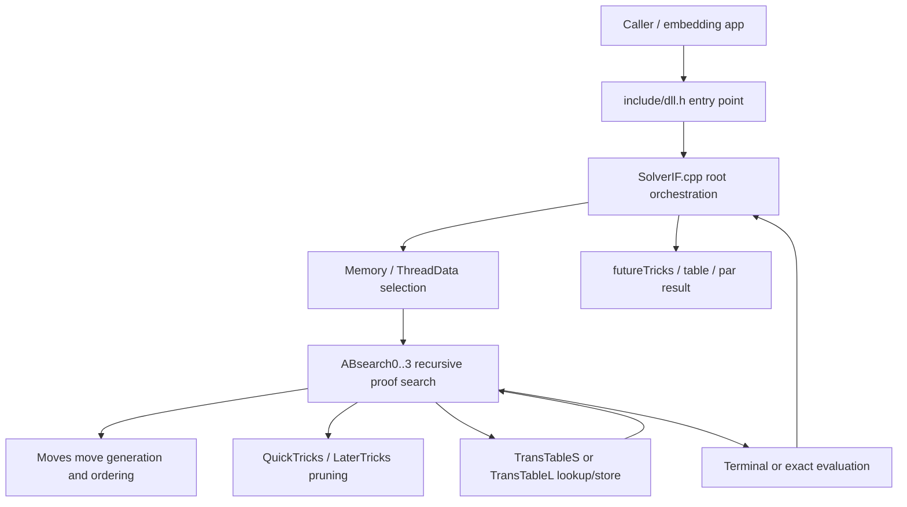
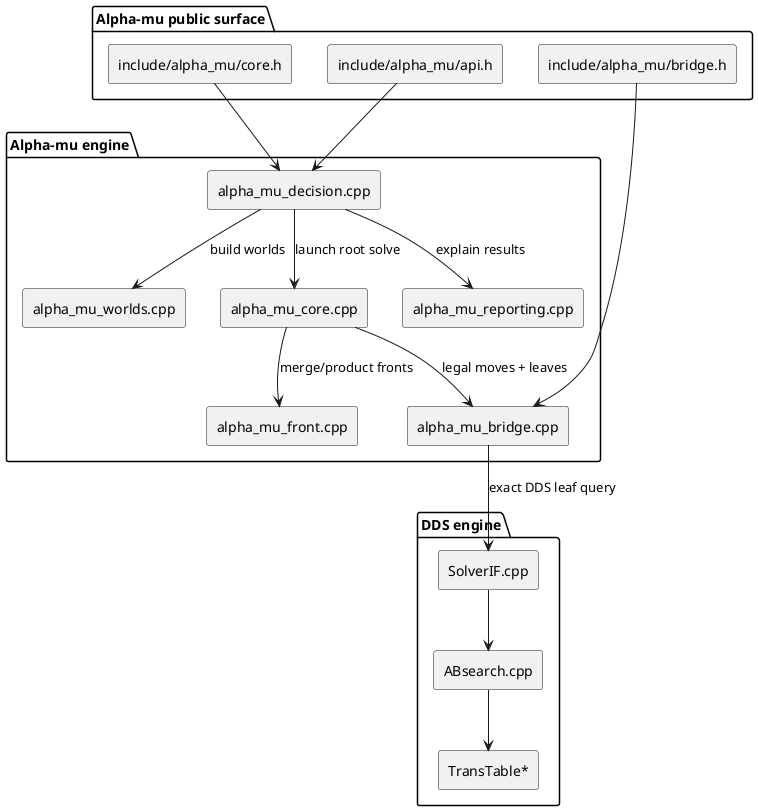

# Architecture Diagrams

This page collects diagram-source blocks in several formats so the repository can
explain the same architecture from multiple viewpoints.

## Repository layering in D2

```d2
vars: {
  dds_fill: "#d8ecff"
  alpha_fill: "#e6ffe1"
  infra_fill: "#fff1d6"
}

Public_API: {
  label: "Public API\ninclude/dll.h"
  style.fill: ${dds_fill}
}

DDS_Root: {
  label: "DDS root orchestration\nSolverIF / CalcTables / PlayAnalyser / Par"
  style.fill: ${dds_fill}
}

DDS_Core: {
  label: "DDS recursive core\nABsearch / Moves / QuickTricks / LaterTricks"
  style.fill: ${dds_fill}
}

DDS_State: {
  label: "DDS state and caches\ndds.h / Memory / TransTable"
  style.fill: ${dds_fill}
}

AlphaMu_Public: {
  label: "Alpha-mu public wrappers\ninclude/alpha_mu/*.h"
  style.fill: ${alpha_fill}
}

AlphaMu_Worlds: {
  label: "Alpha-mu world pipeline\nalpha_mu_worlds / alpha_mu_decision"
  style.fill: ${alpha_fill}
}

AlphaMu_Search: {
  label: "Alpha-mu search and fronts\nalpha_mu_core / alpha_mu_front / alpha_mu_bridge"
  style.fill: ${alpha_fill}
}

Tools: {
  label: "Runners and tests\ntest/alpha_mu.cpp / alpha_mu_tests / examples"
  style.fill: ${infra_fill}
}

Public_API -> DDS_Root: "solve / calc / par / analyse"
DDS_Root -> DDS_Core: "threshold probes"
DDS_Core -> DDS_State: "pos, TT, thread state"
AlphaMu_Public -> AlphaMu_Worlds: "decision requests"
AlphaMu_Worlds -> AlphaMu_Search: "BridgeState + worlds"
AlphaMu_Search -> DDS_Root: "DDS leaf solve"
Tools -> Public_API
Tools -> AlphaMu_Public
```

## DDS request flow in Mermaid



## Alpha-mu component view in PlantUML



## DDS derived-workflow sequence in Mermaid

```mermaid
sequenceDiagram
    participant Caller
    participant API as Public API
    participant Batch as SolveBoard/CalcTables/PlayAnalyser layer
    participant Root as SolverIF
    participant Search as ABsearch core
    participant TT as TT backend
    participant Par as Par.cpp

    Caller->>API: CalcDDtable / AnalysePlay / DealerPar
    API->>Batch: normalize batch or trace request
    Batch->>Root: SolveBoard / SolveSameBoard / AnalyseLaterBoard
    Root->>Search: threshold proof search
    Search->>TT: lookup / add bounds
    TT-->>Search: cached proof data
    Search-->>Root: exact trick result
    Root-->>Batch: futureTricks or exact score
    Batch-->>API: DD table / solved trace
    API->>Par: optional par conversion from DD table
    Par-->>Caller: par contracts and scores
```

## Search-state relationship in GraphViz DOT

```dot
digraph AlphaMuStateFlow {
  rankdir=LR;
  node [shape=box, style=rounded];

  Information [label="BridgeInformationState\nconstraints + play history"];
  Worlds [label="Candidate worlds\nParsedWorld[]"];
  State [label="BridgeState\npossibleWorlds + trick state"];
  Front [label="ParetoFront\noutcome vectors"];
  TT [label="Alpha-mu TT\nexact fronts by state/world key"];
  DDS [label="DDS leaf solve\nperfect-information oracle"];
  Report [label="BridgeRootReport / explanations"];

  Information -> Worlds [label="construct + filter"];
  Worlds -> State [label="compact to <= 64 worlds"];
  State -> Front [label="search node evaluation"];
  State -> TT [label="lookup / store exact front"];
  TT -> Front [label="reuse solved front"];
  State -> DDS [label="leaf materialization per world"];
  DDS -> Front [label="OutcomeVector values"];
  Front -> Report [label="root summaries and explanations"];
}
```



## How to use these diagrams

- The D2 diagram is best for repository ownership and layering.
- The Mermaid diagram is best for the DDS request path.
- The PlantUML diagram is best for alpha-mu module boundaries.
- The GraphViz diagram is best for alpha-mu data-flow and TT relationships.

