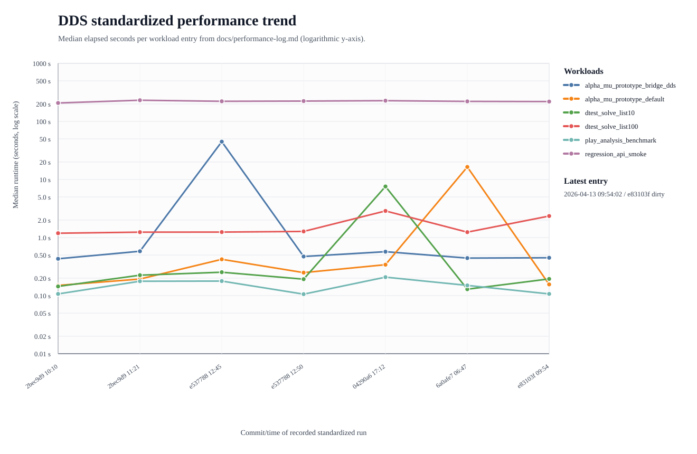

# Performance Log

This file records standardized post-change performance runs from `test/standard_performance.py`.

Each entry links to a timestamped result bundle under `test/build/performance_runs/`.

_The graph uses two aligned logarithmic panels: cumulative runtime at the top and per-board runtime at the bottom for entries that record board counts. Where explicit board timings are recorded, the lower panel shows individual board samples plus the median trend; older entries without board lists fall back to their recorded per-board average._

_Entries that include a `Timing stabilization` section use warmup runs plus adaptive repeat counts for short workloads so the reported medians are stable to about `0.1 s` or better._

_If an entry includes `Graph outliers`, those workload values remain recorded below but are shown as hollow X markers and excluded from the corresponding trend line in the graph._

## 2026-04-12 10:10:11 — commit `2bec9d9` (dirty)

- Output bundle: `test/build/performance_runs/20260412-095932`
- Platform: `macOS-26.4-arm64-arm-64bit`
- Repeats per workload: `3`

| Workload | Median (s) | Mean (s) | Min (s) | Max (s) |
| --- | ---: | ---: | ---: | ---: |
| `regression_api_smoke` | 207.714 | 209.947 | 200.656 | 221.469 |
| `dtest_solve_list10` | 0.144 | 0.166 | 0.121 | 0.233 |
| `dtest_solve_list100` | 1.188 | 1.222 | 1.187 | 1.290 |
| `play_analysis_benchmark` | 0.107 | 0.106 | 0.103 | 0.109 |
| `alpha_mu_prototype_default` | 0.150 | 0.250 | 0.149 | 0.452 |
| `alpha_mu_prototype_bridge_dds` | 0.431 | 0.430 | 0.424 | 0.434 |

## 2026-04-12 11:21:28 — commit `2bec9d9` (dirty)

- Output bundle: `test/build/performance_runs/20260412-standard-baseline`
- Platform: `macOS-26.4-arm64-arm-64bit`
- Repeats per workload: `1`

| Workload | Median (s) | Mean (s) | Min (s) | Max (s) |
| --- | ---: | ---: | ---: | ---: |
| `regression_api_smoke` | 231.683 | 231.683 | 231.683 | 231.683 |
| `dtest_solve_list10` | 0.225 | 0.225 | 0.225 | 0.225 |
| `dtest_solve_list100` | 1.239 | 1.239 | 1.239 | 1.239 |
| `play_analysis_benchmark` | 0.177 | 0.177 | 0.177 | 0.177 |
| `alpha_mu_prototype_default` | 0.193 | 0.193 | 0.193 | 0.193 |
| `alpha_mu_prototype_bridge_dds` | 0.581 | 0.581 | 0.581 | 0.581 |

## 2026-04-12 12:45:42 — commit `e537788` (dirty)

- Output bundle: `test/build/performance_runs/20260412-124110`
- Platform: `macOS-26.4-arm64-arm-64bit`
- Repeats per workload: `1`
- Graph outliers: `alpha_mu_prototype_bridge_dds`
- Note: `alpha_mu_prototype_bridge_dds` used a temporary overly heavy targeted regression variant before the targeted-scope trim, so it is not directly comparable with later stabilized bridge-dds timings.

| Workload | Median (s) | Mean (s) | Min (s) | Max (s) |
| --- | ---: | ---: | ---: | ---: |
| `regression_api_smoke` | 222.035 | 222.035 | 222.035 | 222.035 |
| `dtest_solve_list10` | 0.253 | 0.253 | 0.253 | 0.253 |
| `dtest_solve_list100` | 1.243 | 1.243 | 1.243 | 1.243 |
| `play_analysis_benchmark` | 0.178 | 0.178 | 0.178 | 0.178 |
| `alpha_mu_prototype_default` | 0.422 | 0.422 | 0.422 | 0.422 |
| `alpha_mu_prototype_bridge_dds` | 44.806 | 44.806 | 44.806 | 44.806 |

## 2026-04-12 12:50:43 — commit `e537788` (dirty)

- Output bundle: `test/build/performance_runs/20260412-124655`
- Platform: `macOS-26.4-arm64-arm-64bit`
- Repeats per workload: `1`

| Workload | Median (s) | Mean (s) | Min (s) | Max (s) |
| --- | ---: | ---: | ---: | ---: |
| `regression_api_smoke` | 224.060 | 224.060 | 224.060 | 224.060 |
| `dtest_solve_list10` | 0.192 | 0.192 | 0.192 | 0.192 |
| `dtest_solve_list100` | 1.275 | 1.275 | 1.275 | 1.275 |
| `play_analysis_benchmark` | 0.106 | 0.106 | 0.106 | 0.106 |
| `alpha_mu_prototype_default` | 0.249 | 0.249 | 0.249 | 0.249 |
| `alpha_mu_prototype_bridge_dds` | 0.472 | 0.472 | 0.472 | 0.472 |

## 2026-04-12 17:12:16 — commit `04290a6` (dirty)

- Output bundle: `test/build/performance_runs/20260412-170734`
- Platform: `macOS-26.4-arm64-arm-64bit`
- Repeats per workload: `1`
- Graph outliers: `dtest_solve_list10`
- Note: `dtest_solve_list10` was a single-run wall-clock startup/scheduling outlier; repeated reruns and the program's own internal timing remained near the historical ~0.1-0.2 s range.

| Workload | Median (s) | Mean (s) | Min (s) | Max (s) |
| --- | ---: | ---: | ---: | ---: |
| `regression_api_smoke` | 227.501 | 227.501 | 227.501 | 227.501 |
| `dtest_solve_list10` | 7.579 | 7.579 | 7.579 | 7.579 |
| `dtest_solve_list100` | 2.874 | 2.874 | 2.874 | 2.874 |
| `play_analysis_benchmark` | 0.208 | 0.208 | 0.208 | 0.208 |
| `alpha_mu_prototype_default` | 0.341 | 0.341 | 0.341 | 0.341 |
| `alpha_mu_prototype_bridge_dds` | 0.571 | 0.571 | 0.571 | 0.571 |

## 2026-04-13 06:47:57 — commit `6a0afe7` (dirty)

- Output bundle: `test/build/performance_runs/20260413-064240`
- Platform: `macOS-26.4-arm64-arm-64bit`
- Requested repeats per workload: `1`
- Timing stabilization:
  - `dtest_solve_list10`: 1 unmeasured warmup run and at least 3 measured repeats to reduce short-run startup noise.
  - `dtest_solve_list100`: 1 unmeasured warmup run and at least 3 measured repeats to reduce short-run startup noise.
- Graph outliers: `alpha_mu_prototype_default`
- Note: `alpha_mu_prototype_default` was a single-run wall-clock outlier; repeated reruns remained near the historical ~0.15-0.2 s range and the later stabilized entry supersedes it for trend interpretation.

| Workload | Median (s) | Mean (s) | Min (s) | Max (s) |
| --- | ---: | ---: | ---: | ---: |
| `regression_api_smoke` | 221.221 | 221.221 | 221.221 | 221.221 |
| `dtest_solve_list10` | 0.129 | 0.149 | 0.116 | 0.201 |
| `dtest_solve_list100` | 1.239 | 1.233 | 1.211 | 1.248 |
| `play_analysis_benchmark` | 0.150 | 0.150 | 0.150 | 0.150 |
| `alpha_mu_prototype_default` | 16.432 | 16.432 | 16.432 | 16.432 |
| `alpha_mu_prototype_bridge_dds` | 0.443 | 0.443 | 0.443 | 0.443 |

## 2026-04-13 09:54:02 — commit `e83103f` (dirty)

- Output bundle: `test/build/performance_runs/20260413-094756`
- Platform: `macOS-26.4-arm64-arm-64bit`
- Requested repeats per workload: `1`
- Timing stabilization:
  - `dtest_solve_list10`: 1 unmeasured warmup run; 6 measured repeats; minimum measured repeat count raised from requested 1 to 3; cumulative measured wall time target ≥ 1.0 s; automatic repeats capped at 10 unless the user requests more.
  - `dtest_solve_list100`: 1 unmeasured warmup run; 3 measured repeats; minimum measured repeat count raised from requested 1 to 3; cumulative measured wall time target ≥ 1.0 s; automatic repeats capped at 10 unless the user requests more.
  - `play_analysis_benchmark`: 1 unmeasured warmup run; 10 measured repeats; minimum measured repeat count raised from requested 1 to 3; cumulative measured wall time target ≥ 1.0 s; automatic repeats capped at 10 unless the user requests more.
  - `alpha_mu_prototype_default`: 1 unmeasured warmup run; 7 measured repeats; minimum measured repeat count raised from requested 1 to 3; cumulative measured wall time target ≥ 1.0 s; automatic repeats capped at 10 unless the user requests more.
  - `alpha_mu_prototype_bridge_dds`: 1 unmeasured warmup run; 3 measured repeats; minimum measured repeat count raised from requested 1 to 3; cumulative measured wall time target ≥ 1.0 s; automatic repeats capped at 10 unless the user requests more.

| Workload | Median (s) | Mean (s) | Min (s) | Max (s) |
| --- | ---: | ---: | ---: | ---: |
| `regression_api_smoke` | 219.642 | 219.642 | 219.642 | 219.642 |
| `dtest_solve_list10` | 0.194 | 0.191 | 0.171 | 0.199 |
| `dtest_solve_list100` | 2.347 | 2.346 | 2.344 | 2.348 |
| `play_analysis_benchmark` | 0.107 | 0.107 | 0.103 | 0.114 |
| `alpha_mu_prototype_default` | 0.156 | 0.157 | 0.154 | 0.162 |
| `alpha_mu_prototype_bridge_dds` | 0.449 | 0.450 | 0.448 | 0.454 |

## 2026-04-13 21:05:52 — commit `75252de`

- Output bundle: `test/build/performance_runs/20260413-210045`
- Platform: `macOS-26.4-arm64-arm-64bit`
- Requested repeats per workload: `1`
- Timing stabilization:
  - `dtest_solve_list10`: 1 unmeasured warmup run; 9 measured repeats; minimum measured repeat count raised from requested 1 to 3; cumulative measured wall time target ≥ 1.0 s; automatic repeats capped at 10 unless the user requests more.
  - `dtest_solve_list100`: 1 unmeasured warmup run; 3 measured repeats; minimum measured repeat count raised from requested 1 to 3; cumulative measured wall time target ≥ 1.0 s; automatic repeats capped at 10 unless the user requests more.
  - `play_analysis_benchmark`: 1 unmeasured warmup run; 10 measured repeats; minimum measured repeat count raised from requested 1 to 3; cumulative measured wall time target ≥ 1.0 s; automatic repeats capped at 10 unless the user requests more.
  - `alpha_mu_prototype_default`: 1 unmeasured warmup run; 7 measured repeats; minimum measured repeat count raised from requested 1 to 3; cumulative measured wall time target ≥ 1.0 s; automatic repeats capped at 10 unless the user requests more.
  - `alpha_mu_prototype_bridge_dds`: 1 unmeasured warmup run; 3 measured repeats; minimum measured repeat count raised from requested 1 to 3; cumulative measured wall time target ≥ 1.0 s; automatic repeats capped at 10 unless the user requests more.

| Workload | Median (s) | Mean (s) | Min (s) | Max (s) |
| --- | ---: | ---: | ---: | ---: |
| `regression_api_smoke` | 252.324 | 252.324 | 252.324 | 252.324 |
| `dtest_solve_list10` | 0.121 | 0.124 | 0.109 | 0.143 |
| `dtest_solve_list100` | 1.250 | 1.249 | 1.202 | 1.296 |
| `play_analysis_benchmark` | 0.106 | 0.108 | 0.098 | 0.131 |
| `alpha_mu_prototype_default` | 0.147 | 0.147 | 0.139 | 0.154 |
| `alpha_mu_prototype_bridge_dds` | 0.449 | 0.448 | 0.437 | 0.458 |

## 2026-04-16 17:10:55 — commit `e11ce28` (dirty)

- Output log: `test/build/alpha_mu_depth2_list10.log`
- Status sidecar: `test/build/alpha_mu_depth2_list10.log.status.json`
- Platform: `macOS-26.4.1-arm64-arm-64bit`
- Benchmark mode: `alpha_mu_prototype benchmark_alpha`
- Checkpoint interval: `30 s`
- Heartbeat interval: `30 s`

| Workload | Boards | Total (s) | Per board (s) |
| --- | ---: | ---: | ---: |
| `alpha_mu_prototype_list10_depth2` | 10 | 653.456 | 65.346 |

## 2026-04-16 19:19:08 — commit `b12ad9e`

- Output log: `test/build/list10_alpha_mu_depth2_20260416-190836.log`
- Status sidecar: `test/build/list10_alpha_mu_depth2_20260416-190836.log.status.json`
- Platform: `macOS-26.4.1-arm64-arm-64bit`
- Benchmark mode: `alpha_mu_prototype benchmark_alpha`
- Checkpoint interval: `30 s`
- Heartbeat interval: `30 s`

| Workload | Boards | Total (s) | Per board (s) |
| --- | ---: | ---: | ---: |
| `alpha_mu_prototype_list10_depth2` | 10 | 631.195 | 63.120 |

## 2026-04-16 20:38:05 — commit `8b27edf` (dirty)

- Output log: `test/build/list10_alpha_mu_depth2_20260416-202717.log`
- Status sidecar: `test/build/list10_alpha_mu_depth2_20260416-202717.log.status.json`
- Platform: `macOS-26.4.1-arm64-arm-64bit`
- Benchmark mode: `alpha_mu_prototype benchmark_alpha`
- Checkpoint interval: `30 s`
- Heartbeat interval: `30 s`

| Workload | Boards | Total (s) | Per board (s) |
| --- | ---: | ---: | ---: |
| `alpha_mu_prototype_list10_depth2` | 10 | 647.090 | 64.709 |

- Per-board timings for `alpha_mu_prototype_list10_depth2` (s): `33.676, 424.807, 18.545, 33.332, 14.847, 29.519, 9.362, 50.346, 18.946, 13.711`

## 2026-04-18 08:46:32 — pre-parallelisation depth-3 alpha-mu baseline

- Output log: `test/build/list10_alpha_mu_depth3_skip2_long.log`
- Status sidecar: `test/build/list10_alpha_mu_depth3_skip2_long.log.status.json`
- Platform: `macOS-26.4.1-arm64-arm-64bit`
- Benchmark mode: `alpha_mu_prototype benchmark_alpha`
- Command: `./build/alpha_mu_prototype benchmark_alpha hands/list10.txt 3 0 2`
- Checkpoint interval: `60 s`
- Heartbeat interval: `60 s`
- Result: `returncode=0`, `mismatches=0`
- Note: Skip spec `2` skipped board `2`, so the run covered boards `1, 3, 4, 5, 6, 7, 8, 9, 10`.

| Workload | Boards | Total (s) | Per board (s) |
| --- | ---: | ---: | ---: |
| `alpha_mu_prototype_list10_depth3_skip2` | 9 | 42065.418 | 4673.935 |

- Per-board timings for `alpha_mu_prototype_list10_depth3_skip2` (s): `4559.504, 3883.365, 4634.658, 3851.057, 7581.362, 2623.548, 5916.843, 5429.650, 3585.430`
- Fastest board: `7` at `2623.548 s`
- Slowest board: `6` at `7581.362 s`
- Conclusion: the nearly `3x` spread between boards makes this a strong pre-parallelisation baseline for PR 2 and argues for dynamic queue-based board scheduling rather than static board partitioning.

## 2026-04-18 10:10:43 — multicore profiling run for `list9` depth 2

- Output log: `test/build-profile/list9_alpha_mu_depth2_board10_profile.log`
- Sample profile: `test/build-profile/list9_alpha_mu_depth2_board10_profile.sample.txt`
- Platform: `macOS-26.4.1-arm64-arm-64bit`
- Benchmark mode: `alpha_mu_prototype benchmark_alpha`
- Build: `build-profile` (`-O2 -g -fno-omit-frame-pointer`)
- Command: `./build-profile/alpha_mu_prototype benchmark_alpha ../hands/list9.txt 2 0 --parallel board --board-workers 10`
- Result: `mismatches=0`
- Note: `hands/list9.txt` contains `9` boards, so the run requested `10` board workers but correctly clamped to `configured_board_workers=9`.

| Workload | Boards | Total (s) | Per board (s) |
| --- | ---: | ---: | ---: |
| `alpha_mu_prototype_list9_depth2_board_parallel_profile` | 9 | 60.683 | 35.109 |

- Per-board timings for `alpha_mu_prototype_list9_depth2_board_parallel_profile` (s): `44.944, 29.038, 43.490, 27.337, 43.830, 15.335, 60.678, 28.566, 22.766`
- Fastest board: `6` at `15.335 s`
- Slowest board: `7` at `60.678 s`
- Conclusion: with one board worker per board, total wall time almost exactly matched the slowest board, which confirms that the board-parallel scheduler is distributing the `list9` depth-2 workload effectively.
- Profiling takeaway: the sampled hot path was `SearchBridgeStateInternal -> MakeBridgeDDSLeafFront -> SolveBoardPBN -> SolveBoardInternal -> ABsearch*`, so DDS-side optimisation should focus first on `ABsearch*`; `QuickTricks` and move generation appeared mainly as subordinate work inside that search subtree rather than as separate top-level bottlenecks.

## 2026-04-18 12:04:48 — M1 Max-specific `ABsearch` follow-up on `list9` depth 2

- Platform: `macOS-26.4.1-arm64-arm-64bit`
- Benchmark mode: `alpha_mu_prototype benchmark_alpha`
- Workload: `../hands/list9.txt`, depth `2`, `--parallel board --board-workers 10`
- Result: all three runs completed with `mismatches=0`
- Baseline output log: `test/build/list9_alpha_mu_depth2_board10_release_baseline.log`
- Tuned output log: `test/build/list9_alpha_mu_depth2_board10_release_m1max.log`
- PGO training log: `test/build-pgo-generate/list9_alpha_mu_depth2_board10_pgo_training.log`
- PGO output log: `test/build-pgo-use/list9_alpha_mu_depth2_board10_pgo_use.log`
- Build notes:
  - Baseline and tuned release runs used `build/libdds.so` with the normal release flags.
  - The tuned run added the new `DDS_TARGET_APPLE_M1_MAX` path for `ABsearch*`.
  - The PGO run used clang `-fprofile-instr-use` with profile data collected from the same workload via `build-pgo-generate`.

| Variant | Build | Boards | Total (s) | Per board (s) | Delta vs baseline |
| --- | --- | ---: | ---: | ---: | ---: |
| Portable baseline | `build` | 9 | 67.985 | 38.471 | baseline |
| M1 Max `ABsearch` | `build` | 9 | 53.891 | 28.191 | `-20.7%` wall time |
| M1 Max `ABsearch` + PGO | `build-pgo-use` | 9 | 55.437 | 31.485 | `-18.5%` wall time |

- Per-board timings for the portable baseline (s): `49.668, 31.486, 48.284, 27.865, 44.125, 18.637, 67.983, 32.115, 26.079`
- Per-board timings for the M1 Max `ABsearch` run (s): `38.254, 21.486, 36.181, 18.102, 33.645, 12.295, 53.891, 22.558, 17.307`
- Per-board timings for the M1 Max `ABsearch` + PGO run (s): `41.131, 25.747, 39.115, 22.597, 36.021, 15.141, 55.436, 26.368, 21.810`
- Fastest measured variant on this workload: the non-PGO M1 Max-specific `ABsearch` build at `53.891 s` total.
- PGO observation: on this single workload-specific run, PGO still beat the original portable baseline but trailed the non-PGO M1 Max build by about `2.9%`, so the new PGO target is useful for experimentation but should not replace the normal release build unless repeated runs confirm a net win.

## 2026-04-18 — staged data-structure follow-up on `list9` depth 2

- Platform: `macOS-26.4.1-arm64-arm-64bit`
- Benchmark mode: `alpha_mu_prototype benchmark_alpha`
- Workload: `../hands/list9.txt`, depth `2`, `--parallel board --board-workers 10`
- Stage order used for safe rollout: `8.1` hot/cold `ThreadData`, then `8.5` hot-field co-location in `pos`, then `8.4` packed `moveType`, then `8.3` depth-local scratch state.
- Regression checks run after each stage: `regression_api`, `dtest -f ../hands/list10.txt -s solve`, and `play_analysis_benchmark`.
- Focused performance check after each stage: `alpha_mu_prototype benchmark_alpha ../hands/list9.txt 2 0 --parallel board --board-workers 10`.
- Result summary: all focused `dtest` and `play_analysis_benchmark` runs completed successfully; `alpha_mu` stayed exact with `mismatches=0` in every staged run.

| Stage | Change | Output log | Total (s) | Per board (s) | Delta vs fresh stage-0 baseline |
| --- | --- | --- | ---: | ---: | ---: |
| Stage 0 | Fresh post-ABsearch baseline | `test/build/list9_alpha_mu_depth2_board10_stage0.log` | 64.150 | 35.533 | baseline |
| Stage 1 | `8.1` split `ThreadData` hot/cold | `test/build/list9_alpha_mu_depth2_board10_stage1.log` | 55.111 | 29.129 | `-14.1%` |
| Stage 2 | `8.5` co-locate hot `pos` fields | `test/build/list9_alpha_mu_depth2_board10_stage2.log` | 78.814 | 43.724 | `+22.9%` |
| Stage 2 rerun | confirm stage-2 slowdown | `test/build/list9_alpha_mu_depth2_board10_stage2_rerun.log` | 73.989 | 43.967 | `+15.3%` |
| Stage 3 | `8.4` packed `moveType` | `test/build/list9_alpha_mu_depth2_board10_stage3.log` | 68.174 | 41.511 | `+6.3%` |
| Stage 4 | `8.3` depth-local scratch pad + removed dead `ThreadData::lowestWin` | `test/build/list9_alpha_mu_depth2_board10_stage4.log` | 86.258 | 45.036 | `+34.5%` |

- Supporting regression logs:
  - Stage 0: `test/build/regression_api_stage0.log`, `test/build/dtest_list10_stage0.log`, `test/build/play_analysis_stage0.log`
  - Stage 1: `test/build/regression_api_stage1.log`, `test/build/dtest_list10_stage1.log`, `test/build/play_analysis_stage1.log`
  - Stage 2: `test/build/regression_api_stage2.log`, `test/build/dtest_list10_stage2.log`, `test/build/play_analysis_stage2.log`
  - Stage 3: `test/build/regression_api_stage3.log`, `test/build/dtest_list10_stage3.log`, `test/build/play_analysis_stage3.log`
  - Stage 4: `test/build/regression_api_stage4.log`, `test/build/dtest_list10_stage4.log`, `test/build/play_analysis_stage4.log`
- Observation: on this machine/workload pair, the pure hot/cold `ThreadData` split was the only step that improved wall time; the subsequent structural changes were either neutral-to-negative or clearly slower in these single-workload release runs, so they should be treated as correctness-preserving experiments rather than wins until repeated benchmarking says otherwise.

## 2026-04-18 — matched single-board profiling ladder on `list9` board `7`

- Platform: `macOS-26.4.1-arm64-arm-64bit`
- Benchmark mode: `alpha_mu_prototype benchmark_alpha`
- Build: `build-profile` (`-O2 -g -fno-omit-frame-pointer`)
- Focused workload: `../hands/list9.txt`, depth `2`, board `7` only via skip spec `1-6,8-9`, `--parallel serial --board-workers 1 --root-workers 1 --dds-thread-id 0`
- Purpose: remove all-board and board-parallel noise and check where the severe current-tree slowdown first appears on the earlier slow board `7`.
- Reconstruction note: stage `1`, stage `2`, and stage `3` were rebuilt in detached scratch worktrees from clean `170e566` and their logs/samples were copied back into `test/build-profile/` for stable references below.

| Variant | Change set | Output log | Sample profile | Total (s) | Delta vs stage 1 |
| --- | --- | --- | --- | ---: | ---: |
| Stage 1 | `8.1` hot/cold `ThreadData` only | `test/build-profile/list9_alpha_mu_depth2_board7_profile_stage1.log` | `test/build-profile/list9_alpha_mu_depth2_board7_profile_stage1.sample.txt` | 52.758 | baseline |
| Stage 2 | stage 1 + `8.5` `pos` hot-field reorder | `test/build-profile/list9_alpha_mu_depth2_board7_profile_stage2.log` | `test/build-profile/list9_alpha_mu_depth2_board7_profile_stage2.sample.txt` | 51.566 | `-2.3%` |
| Stage 3 | stage 2 + `8.4` packed `moveType` | `test/build-profile/list9_alpha_mu_depth2_board7_profile_stage3.log` | `test/build-profile/list9_alpha_mu_depth2_board7_profile_stage3.sample.txt` | 49.399 | `-6.4%` |
| Current tree | current dirty post-`8.3` tree | `test/build-profile/list9_alpha_mu_depth2_board7_profile_run2.log` | `test/build-profile/list9_alpha_mu_depth2_board7_profile_run2.sample.txt` | 74.161 | `+40.6%` |

- Progress-rate comparison on the same board showed that stages `2` and `3` stayed ahead of stage `1`, while the current tree fell far behind:
  - around `20 s`: stage `1` reached `63488` recursive / `41671` DDS-leaf calls, stage `2` reached `67584` / `44374`, stage `3` reached `66560` / `43698`, while the current tree reached only `36864` / `24195`
  - around `40 s`: stage `1` reached `121856` / `80199`, stage `2` reached `123904` / `81568`, stage `3` reached `129024` / `84958`, while the current tree reached only `87040` / `57172`
- All four samples kept the same dominant DDS-heavy subtree: `SearchBridgeStateInternal -> MakeBridgeDDSLeafFront -> SolveBoardPBN -> SolveBoardInternal -> ABsearch*`.
  - Current tree sample: `MakeBridgeDDSLeafFront=7006`, `SolveBoardInternal=5922`, `ABsearch=5912` out of `12087` samples
  - Stage `1` sample: `8955`, `7292`, `7276` out of `12192`
  - Stage `2` sample: `8406`, `6856`, `6851` out of `12013`
  - Stage `3` sample: `8380`, `6697`, `6689` out of `12142`
- Interpretation: this matched one-board serial profile **did not** reproduce the earlier all-board release regression for stages `2` and `3`; on board `7`, both remained at least as fast as stage `1`, and stage `3` was fastest. The severe slowdown only appeared in the current post-`8.3` tree, so on this board the first change set that clearly correlates with the regression is the stage-`4` / `8.3` depth-local scratch-pad integration rather than the earlier `8.5` or `8.4` layout changes.

