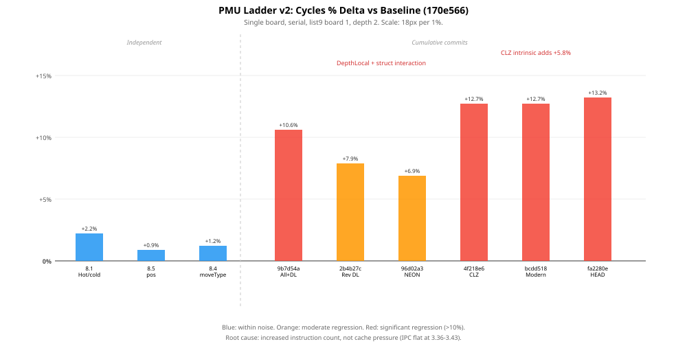

# Performance Log

This file records standardized post-change performance runs from `test/standard_performance.py`.

Each entry links to a timestamped result bundle under `test/build/performance_runs/`.

_The graph uses two aligned logarithmic panels: cumulative runtime at the top and per-board runtime at the bottom for entries that record board counts. Where explicit board timings are recorded, the lower panel shows individual board samples plus the median trend; older entries without board lists fall back to their recorded per-board average._

_Entries that include a `Timing stabilization` section use warmup runs plus adaptive repeat counts for short workloads so the reported medians are stable to about `0.1 s` or better._

_If an entry includes `Graph outliers`, those workload values remain recorded below but are shown as hollow X markers and excluded from the corresponding trend line in the graph._

## 2026-05-06 00:00:00 — Corrected residual `ab_us` split snapshot on commit `c97abd8` (dirty)

- Captured logs:
  - `test/build/ab_subphase_regression_api_list1.log`
  - `test/build/ab_subphase_regression_api_list1.stderr`
  - `test/build/ab_subphase_play_analysis.log`
  - `test/build/ab_subphase_play_analysis.stderr`
  - `test/build/aggregate_ab_snapshot.py`
- Platform: Apple-Silicon macOS host
- Result: after the AB instrumentation cleanup pass, both focused commands were
  rerun successfully. The heavier `list10` regression lane remained too slow
  under the expanded instrumentation for a clean full-session capture, so the
  recorded aggregate below uses the finished `regression_api ../hands/list1.txt`
  rerun plus the refreshed full play-analysis log.

| Command | Status | Notes |
| --- | --- | --- |
| `test/build-instrumented/regression_api ../hands/list1.txt` | pass | Finished cleanly in the focused rerun; produced `1223` complete root lines for aggregation. |
| `test/build-instrumented/play_analysis_benchmark` | pass | Refreshed after the cleanup pass; produced `107` complete root lines for aggregation. |

### Root-line coverage by file

| Log | Complete root lines | `SolveBoardInternal` | `SolveSameBoard` | `AnalyseLaterBoard` |
| --- | ---: | ---: | ---: | ---: |
| `ab_subphase_regression_api_list1.log` | `1223` | `143` | `360` | `720` |
| `ab_subphase_play_analysis.log` | `107` | `3` | `0` | `104` |
| Combined snapshot | `1330` | `146` | `360` | `824` |

### Aggregate DDS phase shares from the residual-AB snapshot

The phase totals below are summed across all complete emitted root lines in the
snapshot, so they are most useful as a relative hotspot breakdown rather than as
wall-clock accounting.

| Phase | Total | Share |
| --- | ---: | ---: |
| `ab_us` | `670461281 us` | `92.13%` |
| `make_us` | `32381611 us` | `4.45%` |
| `undo_us` | `6800595 us` | `0.93%` |
| `movegen_us` | `5962693 us` | `0.82%` |
| `nextmove_us` | `3549788 us` | `0.49%` |
| `lookup_us` | `3505415 us` | `0.48%` |
| `qt_us` | `3019330 us` | `0.41%` |
| `lt_us` | `1192725 us` | `0.16%` |
| `build_us` | `839129 us` | `0.12%` |
| `eval_us` | `16487 us` | `0.00%` |

### AB residual split from the snapshot

| AB diagnostic field | Total | Share of `ab_us` |
| --- | ---: | ---: |
| `ab_terminal_us` | `12820004 us` | `1.91%` |
| `ab_childloop_us` | `9798245 us` | `1.46%` |
| `ab_cutoff_us` | `7062954 us` | `1.05%` |
| `ab_recurse_setup_us` | `2068775 us` | `0.31%` |
| `ab_node_setup_us` | `5181353 us` | `0.77%` |
| `ab_loop_control_us` | `13985745 us` | `2.09%` |
| `ab_post_child_us` | `6637068 us` | `0.99%` |
| `ab_tt_prep_us` | `3269931 us` | `0.49%` |
| `ab_setup_us` | `25008575 us` | `3.73%` |
| `ab_terminal_control_us` | `17963028 us` | `2.68%` |
| `ab_iteration_control_us` | `204718199 us` | `30.53%` |
| `ab_store_prep_us` | `2685133 us` | `0.40%` |
| `ab_other_us` | `407266342 us` | `60.74%` |

### Context-level AB summary

| Context | Complete root lines | Share of measured phase time | AB diagnostic mix |
| --- | ---: | ---: | --- |
| `SolveBoardInternal` | `146` | `68.94%` | `ab_other_us 58.18%`, `ab_iteration_control_us 32.03%`, `ab_setup_us 4.33%`, `ab_terminal_control_us 3.11%` |
| `SolveSameBoard` | `360` | `30.09%` | `ab_other_us 66.02%`, `ab_iteration_control_us 27.43%`, `ab_setup_us 2.49%`, `ab_terminal_us 2.00%` |
| `AnalyseLaterBoard` | `824` | `0.97%` | `ab_other_us 73.63%`, `ab_iteration_control_us 23.78%`; all other named AB buckets remain small in this context |

### Residual-AB conclusion

- After the cleanup pass, the coarse residual partition is materially more
  informative than the earlier distorted snapshot: `ab_iteration_control_us`
  now accounts for `30.53%` of `ab_us`, while `ab_other_us` falls to `60.74%`.
- `ab_other_us` remains the single largest AB bucket, but it is no longer an
  overwhelming ~90% residual. The corrected split now exposes two primary
  coarse targets: the remaining residual body and the iteration/control portion
  around the recursive child-processing loop.
- `SolveBoardInternal` and `SolveSameBoard` still contain effectively all of the
  material signal (`99.03%` of measured phase time combined), and both show the
  same shape: a still-dominant `ab_other_us` bucket plus a now-substantial
  `ab_iteration_control_us` bucket.
- So the corrected next step is narrower than before: prioritize analysis of
  the still-largest `ab_other_us` core, but treat `ab_iteration_control_us` as a
  first-class follow-on hotspot rather than as background noise.

## 2026-05-05 00:00:00 — Stage 4 / PR 4 evidence refresh on commit `c97abd8` (dirty)

- Captured logs:
  - `test/build/instrumented_regression_api_stage4.log`
  - `test/build/instrumented_regression_api_stage4.time`
  - `test/build/instrumented_play_analysis_stage4.log`
  - `test/build/instrumented_play_analysis_stage4.time`
- Platform: Apple-Silicon macOS host
- Result: both focused instrumented checks completed with exit status `0`

| Command | Status | Wall clock | Notes |
| --- | --- | ---: | --- |
| `test/build-instrumented/regression_api ../hands/list10.txt` | pass | `527.28 s` | Focused Stage-4 rerun against the shortened `list10` lane; output ended with `regression_api: OK`. |
| `test/build-instrumented/play_analysis_benchmark` | pass | `2.90 s` | Instrumented play-analysis confirmation; output completed with status `0`. |

### Root-line coverage by file

| Log | Total root lines | `SolveBoardInternal` | `SolveSameBoard` | `AnalyseLaterBoard` |
| --- | ---: | ---: | ---: | ---: |
| `instrumented_regression_api_stage4.log` | `2884` | `387` | `990` | `1507` |
| `instrumented_play_analysis_stage4.log` | `107` | `3` | `0` | `104` |
| Combined | `2991` | `390` | `990` | `1611` |

### Aggregate DDS phase shares from the refreshed focused lane

The phase totals below are summed across all emitted root lines, so they are most
useful as a relative hotspot breakdown rather than as a wall-clock accounting.

| Phase | Total | Share |
| --- | ---: | ---: |
| `ab_us` | `1232688707 us` | `77.90%` |
| `undo_us` | `128016819 us` | `8.09%` |
| `movegen_us` | `98792259 us` | `6.24%` |
| `qt_us` | `53824201 us` | `3.40%` |
| `lookup_us` | `35972580 us` | `2.27%` |
| `lt_us` | `21685739 us` | `1.37%` |
| `build_us` | `11493366 us` | `0.73%` |

### Context-level summary

| Context | Root lines | Share of measured phase time | Dominant internal phase mix |
| --- | ---: | ---: | --- |
| `SolveBoardInternal` | `390` | `72.00%` | `ab_us 76.79%`, `undo_us 8.49%`, `movegen_us 6.56%`, `qt_us 3.61%` |
| `SolveSameBoard` | `990` | `27.77%` | `ab_us 80.61%`, `undo_us 7.11%`, `movegen_us 5.47%`, `qt_us 2.89%` |
| `AnalyseLaterBoard` | `1611` | `0.23%` | Mostly zero-cost or near-zero exact hits; no material leaf hotspot signal |

### Stage 4 conclusion

- The refreshed focused lane confirms that the remaining material cost is still
  inside `DDS`, not in alpha-mu board scheduling, bridge/front work, or report
  formatting.
- `SolveBoardInternal` and `SolveSameBoard` account for `99.77%` of the measured
  phase total in the focused lane, while `AnalyseLaterBoard` remains negligible.
- Within those DDS leaf contexts, `ab_us` remains the dominant hotspot by a wide
  margin, with `undo_us`, `movegen_us`, and `qt_us` as the next secondary DDS
  buckets.
- That closes the remaining Stage-4 evidence-refresh task. Read together with
  the later clean-slate recovery entries below, the current scoped preserved-
  fallback `Stage 5` cycle is also now closed: the accepted retained endpoint is
  the existing baseline plus compact `moveType`, and no portability-sacrifice
  `PR 5` is justified.

## 2026-04-23 23:07:38 — Workstream 1 DDS baseline revalidated on commit `12c5f5d` (dirty)

- Primary current-commit output bundle: `test/build/alpha_mu_stats/20260423-230442`
- Earlier same-session confirmation bundles: `test/build/alpha_mu_stats/20260423-223955`, `test/build/alpha_mu_stats/20260423-225540`
- Platform: `Darwin 25.4.0 arm64 (macOS, M1 Max class host)`
- Repository state at capture time: untracked top-level `build/` directory present
- Commit note: `12c5f5d` only updated this log, so the DDS/test binaries used by the three bundles were code-equivalent to the earlier `9c57806` measurement state.
- Result: all three `alpha_mu_benchmark.py` runs and all three direct normal-build smoke reruns completed with `returncode=0`

| Command | Status | Wall clock | Notes |
| --- | --- | ---: | --- |
| `python3 test/alpha_mu_benchmark.py` | pass | `148.925 s` (current rerun) | Fresh current-commit rerun; per-workload timings recorded in `20260423-230442`; runner restored the normal DDS build afterwards. |
| `test/build/regression_api ../hands/list10.txt ../hands/thomas1.txt` | pass | `110.93 s` | Direct normal-build rerun via `/usr/bin/time -p`; output ended with `regression_api: OK`. |
| `test/build/dtest -f ../hands/list10.txt -s solve` | pass | `0.16 s` | Direct normal-build rerun; program reported `Avg user time (ms) 6.59`. |
| `test/build/play_analysis_benchmark` | pass | `0.14 s` | Direct normal-build rerun; all `3` hands reported `OK`. |

### Instrumented workload timings from `alpha_mu_benchmark.py`

| Workload | `20260423-223955` (s) | `20260423-225540` (s) | `20260423-230442` (s) | Root lines |
| --- | ---: | ---: | ---: | ---: |
| `regression_api_smoke` | `122.112` | `106.078` | `118.570` | `451` |
| `dtest_solve_list10` | `6.128` | `0.211` | `0.227` | `0` |
| `dtest_solve_list100` | `2.239` | `0.844` | `0.635` | `0` |
| `play_analysis_benchmark` | `0.402` | `0.143` | `0.115` | `107` |

### Probe-count summaries by context

All three instrumentation runs produced identical `root_stats_by_context` payloads and the same total root-line count (`558`).

| Context | Count | Avg probes | Min | Max | Guess relations |
| --- | ---: | ---: | ---: | ---: | --- |
| `AnalyseLaterBoard` | `104` | `1.93` | `1` | `3` | `{"below": 2, "exact": 102}` |
| `SolveBoardInternal` | `124` | `3.95` | `2` | `7` | `{"above": 56, "below": 52, "exact": 16}` |
| `SolveSameBoard` | `330` | `3.46` | `1` | `13` | `{"above": 168, "below": 70, "exact": 92}` |

### Repeated-solve stability

- `SolveSameBoard` remained stable across all three independent `alpha_mu_benchmark.py` runs: identical counts, identical probe distributions, identical guess-relation counts, and identical final-score histograms in every `summary.json` file.
- The raw instrumentation log in `test/build/alpha_mu_stats/20260423-223955/04_regression_api_smoke.log` shows the repeat-solve path being exercised heavily from `regression_api`, which makes the matching `SolveSameBoard` summaries a meaningful determinism check rather than an empty aggregate.
- Wall-clock time varied noticeably between runs, especially for short workloads, so the stable baseline signal for Workstream 1 is the repeated exact same probe/result summary rather than any single raw elapsed-time sample.

## 2026-04-12 10:10:11 — commit `2bec9d9` (dirty)

- Output bundle: `test/build/performance_runs/20260412-095932`
- Platform: `macOS-26.4-arm64-arm-64bit`
- Repeats per workload: `3`

| Workload | Median (s) | Mean (s) | Min (s) | Max (s) |
| --- | ---: | ---: | ---: | ---: |
| `regression_api_smoke` | 207.714 | 209.947 | 200.656 | 221.469 |
| `dtest_solve_list10` | 0.144 | 0.166 | 0.121 | 0.233 |
| `dtest_solve_list100` | 1.188 | 1.222 | 1.187 | 1.290 |
| `play_analysis_benchmark` | 0.107 | 0.106 | 0.103 | 0.109 |
| `alpha_mu_default` | 0.150 | 0.250 | 0.149 | 0.452 |
| `alpha_mu_bridge_dds` | 0.431 | 0.430 | 0.424 | 0.434 |

## 2026-04-12 11:21:28 — commit `2bec9d9` (dirty)

- Output bundle: `test/build/performance_runs/20260412-standard-baseline`
- Platform: `macOS-26.4-arm-64bit`
- Repeats per workload: `1`

| Workload | Median (s) | Mean (s) | Min (s) | Max (s) |
| --- | ---: | ---: | ---: | ---: |
| `regression_api_smoke` | 231.683 | 231.683 | 231.683 | 231.683 |
| `dtest_solve_list10` | 0.225 | 0.225 | 0.225 | 0.225 |
| `dtest_solve_list100` | 1.239 | 1.239 | 1.239 | 1.239 |
| `play_analysis_benchmark` | 0.177 | 0.177 | 0.177 | 0.177 |
| `alpha_mu_default` | 0.193 | 0.193 | 0.193 | 0.193 |
| `alpha_mu_bridge_dds` | 0.581 | 0.581 | 0.581 | 0.581 |

## 2026-04-12 12:45:42 — commit `e537788` (dirty)

- Output bundle: `test/build/performance_runs/20260412-124110`
- Platform: `macOS-26.4-arm-64bit`
- Repeats per workload: `1`
- Graph outliers: `alpha_mu_bridge_dds`
- Note: `alpha_mu_bridge_dds` used a temporary overly heavy targeted regression variant before the targeted-scope trim, so it is not directly comparable with later stabilized bridge-dds timings.

| Workload | Median (s) | Mean (s) | Min (s) | Max (s) |
| --- | ---: | ---: | ---: | ---: |
| `regression_api_smoke` | 222.035 | 222.035 | 222.035 | 222.035 |
| `dtest_solve_list10` | 0.253 | 0.253 | 0.253 | 0.253 |
| `dtest_solve_list100` | 1.243 | 1.243 | 1.243 | 1.243 |
| `play_analysis_benchmark` | 0.178 | 0.178 | 0.178 | 0.178 |
| `alpha_mu_default` | 0.422 | 0.422 | 0.422 | 0.422 |
| `alpha_mu_bridge_dds` | 44.806 | 44.806 | 44.806 | 44.806 |

## 2026-04-12 12:50:43 — commit `e537788` (dirty)

- Output bundle: `test/build/performance_runs/20260412-124655`
- Platform: `macOS-26.4-arm-64bit`
- Repeats per workload: `1`

| Workload | Median (s) | Mean (s) | Min (s) | Max (s) |
| --- | ---: | ---: | ---: | ---: |
| `regression_api_smoke` | 224.060 | 224.060 | 224.060 | 224.060 |
| `dtest_solve_list10` | 0.192 | 0.192 | 0.192 | 0.192 |
| `dtest_solve_list100` | 1.275 | 1.275 | 1.275 | 1.275 |
| `play_analysis_benchmark` | 0.106 | 0.106 | 0.106 | 0.106 |
| `alpha_mu_default` | 0.249 | 0.249 | 0.249 | 0.249 |
| `alpha_mu_bridge_dds` | 0.472 | 0.472 | 0.472 | 0.472 |

## 2026-04-12 17:12:16 — commit `04290a6` (dirty)

- Output bundle: `test/build/performance_runs/20260412-170734`
- Platform: `macOS-26.4-arm-64bit`
- Repeats per workload: `1`
- Graph outliers: `dtest_solve_list10`
- Note: `dtest_solve_list10` was a single-run wall-clock startup/scheduling outlier; repeated reruns and the program's own internal timing remained near the historical ~0.1-0.2 s range.

| Workload | Median (s) | Mean (s) | Min (s) | Max (s) |
| --- | ---: | ---: | ---: | ---: |
| `regression_api_smoke` | 227.501 | 227.501 | 227.501 | 227.501 |
| `dtest_solve_list10` | 7.579 | 7.579 | 7.579 | 7.579 |
| `dtest_solve_list100` | 2.874 | 2.874 | 2.874 | 2.874 |
| `play_analysis_benchmark` | 0.208 | 0.208 | 0.208 | 0.208 |
| `alpha_mu_default` | 0.341 | 0.341 | 0.341 | 0.341 |
| `alpha_mu_bridge_dds` | 0.571 | 0.571 | 0.571 | 0.571 |

## 2026-04-13 06:47:57 — commit `6a0afe7` (dirty)

- Output bundle: `test/build/performance_runs/20260413-064240`
- Platform: `macOS-26.4-arm-64bit`
- Requested repeats per workload: `1`
- Timing stabilization:
  - `dtest_solve_list10`: 1 unmeasured warmup run and at least 3 measured repeats to reduce short-run startup noise.
  - `dtest_solve_list100`: 1 unmeasured warmup run and at least 3 measured repeats to reduce short-run startup noise.
- Graph outliers: `alpha_mu_default`
- Note: `alpha_mu_default` was a single-run wall-clock outlier; repeated reruns remained near the historical ~0.15-0.2 s range and the later stabilized entry supersedes it for trend interpretation.

| Workload | Median (s) | Mean (s) | Min (s) | Max (s) |
| --- | ---: | ---: | ---: | ---: |
| `regression_api_smoke` | 221.221 | 221.221 | 221.221 | 221.221 |
| `dtest_solve_list10` | 0.129 | 0.149 | 0.116 | 0.201 |
| `dtest_solve_list100` | 1.239 | 1.233 | 1.211 | 1.248 |
| `play_analysis_benchmark` | 0.150 | 0.150 | 0.150 | 0.150 |
| `alpha_mu_default` | 16.432 | 16.432 | 16.432 | 16.432 |
| `alpha_mu_bridge_dds` | 0.443 | 0.443 | 0.443 | 0.443 |

## 2026-04-13 09:54:02 — commit `e83103f` (dirty)

- Output bundle: `test/build/performance_runs/20260413-094756`
- Platform: `macOS-26.4-arm-64bit`
- Requested repeats per workload: `1`
- Timing stabilization:
  - `dtest_solve_list10`: 1 unmeasured warmup run; 6 measured repeats; minimum measured repeat count raised from requested 1 to 3; cumulative measured wall time target ≥ 1.0 s; automatic repeats capped at 10 unless the user requests more.
  - `dtest_solve_list100`: 1 unmeasured warmup run; 3 measured repeats; minimum measured repeat count raised from requested 1 to 3; cumulative measured wall time target ≥ 1.0 s; automatic repeats capped at 10 unless the user requests more.
  - `play_analysis_benchmark`: 1 unmeasured warmup run; 10 measured repeats; minimum measured repeat count raised from requested 1 to 3; cumulative measured wall time target ≥ 1.0 s; automatic repeats capped at 10 unless the user requests more.
  - `alpha_mu_default`: 1 unmeasured warmup run; 7 measured repeats; minimum measured repeat count raised from requested 1 to 3; cumulative measured wall time target ≥ 1.0 s; automatic repeats capped at 10 unless the user requests more.
  - `alpha_mu_bridge_dds`: 1 unmeasured warmup run; 3 measured repeats; minimum measured repeat count raised from requested 1 to 3; cumulative measured wall time target ≥ 1.0 s; automatic repeats capped at 10 unless the user requests more.

| Workload | Median (s) | Mean (s) | Min (s) | Max (s) |
| --- | ---: | ---: | ---: | ---: |
| `regression_api_smoke` | 219.642 | 219.642 | 219.642 | 219.642 |
| `dtest_solve_list10` | 0.194 | 0.191 | 0.171 | 0.199 |
| `dtest_solve_list100` | 2.347 | 2.346 | 2.344 | 2.348 |
| `play_analysis_benchmark` | 0.107 | 0.107 | 0.103 | 0.114 |
| `alpha_mu_default` | 0.156 | 0.157 | 0.154 | 0.162 |
| `alpha_mu_bridge_dds` | 0.449 | 0.450 | 0.448 | 0.454 |

## 2026-04-13 21:05:52 — commit `75252de`

- Output bundle: `test/build/performance_runs/20260413-210045`
- Platform: `macOS-26.4-arm-64bit`
- Requested repeats per workload: `1`
- Timing stabilization:
  - `dtest_solve_list10`: 1 unmeasured warmup run; 9 measured repeats; minimum measured repeat count raised from requested 1 to 3; cumulative measured wall time target ≥ 1.0 s; automatic repeats capped at 10 unless the user requests more.
  - `dtest_solve_list100`: 1 unmeasured warmup run; 3 measured repeats; minimum measured repeat count raised from requested 1 to 3; cumulative measured wall time target ≥ 1.0 s; automatic repeats capped at 10 unless the user requests more.
  - `play_analysis_benchmark`: 1 unmeasured warmup run; 10 measured repeats; minimum measured repeat count raised from requested 1 to 3; cumulative measured wall time target ≥ 1.0 s; automatic repeats capped at 10 unless the user requests more.
  - `alpha_mu_default`: 1 unmeasured warmup run; 7 measured repeats; minimum measured repeat count raised from requested 1 to 3; cumulative measured wall time target ≥ 1.0 s; automatic repeats capped at 10 unless the user requests more.
  - `alpha_mu_bridge_dds`: 1 unmeasured warmup run; 3 measured repeats; minimum measured repeat count raised from requested 1 to 3; cumulative measured wall time target ≥ 1.0 s; automatic repeats capped at 10 unless the user requests more.

| Workload | Median (s) | Mean (s) | Min (s) | Max (s) |
| --- | ---: | ---: | ---: | ---: |
| `regression_api_smoke` | 252.324 | 252.324 | 252.324 | 252.324 |
| `dtest_solve_list10` | 0.121 | 0.124 | 0.109 | 0.143 |
| `dtest_solve_list100` | 1.250 | 1.249 | 1.202 | 1.296 |
| `play_analysis_benchmark` | 0.106 | 0.108 | 0.098 | 0.131 |
| `alpha_mu_default` | 0.147 | 0.147 | 0.139 | 0.154 |
| `alpha_mu_bridge_dds` | 0.449 | 0.448 | 0.437 | 0.458 |

## 2026-04-16 17:10:55 — commit `e11ce28` (dirty)

- Output log: `test/build/alpha_mu_depth2_list10.log`
- Status sidecar: `test/build/alpha_mu_depth2_list10.log.status.json`
- Platform: `macOS-26.4.1-arm64-arm-64bit`
- Benchmark mode: `alpha_mu benchmark_alpha`
- Checkpoint interval: `30 s`
- Heartbeat interval: `30 s`

| Workload | Boards | Total (s) | Per board (s) |
| --- | ---: | ---: | ---: |
| `alpha_mu_list10_depth2` | 10 | 653.456 | 65.346 |

## 2026-04-16 19:19:08 — commit `b12ad9e`

- Output log: `test/build/list10_alpha_mu_depth2_20260416-190836.log`
- Status sidecar: `test/build/list10_alpha_mu_depth2_20260416-190836.log.status.json`
- Platform: `macOS-26.4.1-arm64-arm-64bit`
- Benchmark mode: `alpha_mu benchmark_alpha`
- Checkpoint interval: `30 s`
- Heartbeat interval: `30 s`

| Workload | Boards | Total (s) | Per board (s) |
| --- | ---: | ---: | ---: |
| `alpha_mu_list10_depth2` | 10 | 631.195 | 63.120 |

## 2026-04-16 20:38:05 — commit `8b27edf` (dirty)

- Output log: `test/build/list10_alpha_mu_depth2_20260416-202717.log`
- Status sidecar: `test/build/list10_alpha_mu_depth2_20260416-202717.log.status.json`
- Platform: `macOS-26.4.1-arm64-arm-64bit`
- Benchmark mode: `alpha_mu benchmark_alpha`
- Checkpoint interval: `30 s`
- Heartbeat interval: `30 s`

| Workload | Boards | Total (s) | Per board (s) |
| --- | ---: | ---: | ---: |
| `alpha_mu_list10_depth2` | 10 | 647.090 | 64.709 |

- Per-board timings for `alpha_mu_list10_depth2` (s): `33.676, 424.807, 18.545, 33.332, 14.847, 29.519, 9.362, 50.346, 18.946, 13.711`

## 2026-04-18 08:46:32 — pre-parallelisation depth-3 alpha-mu baseline

- Output log: `test/build/list10_alpha_mu_depth3_skip2_long.log`
- Status sidecar: `test/build/list10_alpha_mu_depth3_skip2_long.log.status.json`
- Platform: `macOS-26.4.1-arm64-arm-64bit`
- Benchmark mode: `alpha_mu benchmark_alpha`
- Command: `./build/alpha_mu benchmark_alpha hands/list10.txt 3 0 2`
- Checkpoint interval: `60 s`
- Heartbeat interval: `60 s`
- Result: `returncode=0`, `mismatches=0`
- Note: Skip spec `2` skipped board `2`, so the run covered boards `1, 3, 4, 5, 6, 7, 8, 9, 10`.

| Workload | Boards | Total (s) | Per board (s) |
| --- | ---: | ---: | ---: |
| `alpha_mu_list10_depth3_skip2` | 9 | 42065.418 | 4673.935 |

- Per-board timings for `alpha_mu_list10_depth3_skip2` (s): `4559.504, 3883.365, 4634.658, 3851.057, 7581.362, 2623.548, 5916.843, 5429.650, 3585.430`
- Fastest board: `7` at `2623.548 s`
- Slowest board: `6` at `7581.362 s`
- Conclusion: the nearly `3x` spread between boards makes this a strong pre-parallelisation baseline for PR 2 and argues for dynamic queue-based board scheduling rather than static board partitioning.

## 2026-04-18 10:10:43 — multicore profiling run for `list9` depth 2

- Output log: `test/build-profile/list9_alpha_mu_depth2_board10_profile.log`
- Sample profile: `test/build-profile/list9_alpha_mu_depth2_board10_profile.sample.txt`
- Platform: `macOS-26.4.1-arm-64bit`
- Benchmark mode: `alpha_mu benchmark_alpha`
- Build: `build-profile` (`-O2 -g -fno-omit-frame-pointer`)
- Command: `./build-profile/alpha_mu benchmark_alpha ../hands/list9.txt 2 0 --parallel board --board-workers 10`
- Result: `mismatches=0`
- Note: `hands/list9.txt` contains `9` boards, so the run requested `10` board workers but correctly clamped to `configured_board_workers=9`.

| Workload | Boards | Total (s) | Per board (s) |
| --- | ---: | ---: | ---: |
| `alpha_mu_list9_depth2_board_parallel_profile` | 9 | 60.683 | 35.109 |

- Per-board timings for `alpha_mu_list9_depth2_board_parallel_profile` (s): `44.944, 29.038, 43.490, 27.337, 43.830, 15.335, 60.678, 28.566, 22.766`
- Fastest board: `6` at `15.335 s`
- Slowest board: `7` at `60.678 s`
- Conclusion: with one board worker per board, total wall time almost exactly matched the slowest board, which confirms that the board-parallel scheduler is distributing the `list9` depth-2 workload effectively.
- Profiling takeaway: the sampled hot path was `SearchBridgeStateInternal -> MakeBridgeDDSLeafFront -> SolveBoardPBN -> SolveBoardInternal -> ABsearch*`, so DDS-side optimisation should focus first on `ABsearch*`; `QuickTricks` and move generation appeared mainly as subordinate work inside that search subtree rather than as separate top-level bottlenecks.

## 2026-04-18 12:04:48 — M1 Max-specific `ABsearch` follow-up on `list9` depth 2

- Platform: `macOS-26.4.1-arm-64bit`
- Benchmark mode: `alpha_mu benchmark_alpha`
- Workload: `../hands/list9.txt`, depth `2`, `--parallel board --board-workers 10`
- Result: all three runs completed with `mismatches=0`
- Baseline output log: `test/build/list9_alpha_mu_depth2_board10_release_baseline.log`
- Tuned output log: `test/build/list9_alpha_mu_depth2_board10_release_m1max.log`
- PGO training log: `test/build-pgo-generate/list9_alpha_mu_depth2_board10_pgo_training.log`
- PGO output log: `test/build-pgo-use/list9_alpha_mu_depth2_board10_pgo_use.log`
- Build notes:
  - Baseline and tuned release runs used `build/libdds.so` with the normal release flags.
  - The tuned run added the new `DDS_TARGET_APPLE_M1_MAX` path for `ABsearch*`.
  - The PGO run used clang `-fprofile-instr-use` with profile data collected from the same workload via `build-pgo-generate`.

| Variant | Build | Boards | Total (s) | Per board (s) | Delta vs baseline |
| --- | --- | ---: | ---: | ---: | ---: |
| Portable baseline | `build` | 9 | 67.985 | 38.471 | baseline |
| M1 Max `ABsearch` | `build` | 9 | 53.891 | 28.191 | `-20.7%` wall time |
| M1 Max `ABsearch` + PGO | `build-pgo-use` | 9 | 55.437 | 31.485 | `-18.5%` wall time |

- Per-board timings for the portable baseline (s): `49.668, 31.486, 48.284, 27.865, 44.125, 18.637, 67.983, 32.115, 26.079`
- Per-board timings for the M1 Max `ABsearch` run (s): `38.254, 21.486, 36.181, 18.102, 33.645, 12.295, 53.891, 22.558, 17.307`
- Per-board timings for the M1 Max `ABsearch` + PGO run (s): `41.131, 25.747, 39.115, 22.597, 36.021, 15.141, 55.436, 26.368, 21.810`
- Fastest measured variant on this workload: the non-PGO M1 Max-specific `ABsearch` build at `53.891 s` total.
- PGO observation: on this single workload-specific run, PGO still beat the original portable baseline but trailed the non-PGO M1 Max build by about `2.9%`, so the new PGO target is useful for experimentation but should not replace the normal release build unless repeated runs confirm a net win.

## 2026-04-18 — staged data-structure follow-up on `list9` depth 2

- Platform: `macOS-26.4.1-arm-64bit`
- Benchmark mode: `alpha_mu benchmark_alpha`
- Workload: `../hands/list9.txt`, depth `2`, `--parallel board --board-workers 10`
- Stage order used for safe rollout: `8.1` hot/cold `ThreadData`, then `8.5` hot-field co-location in `pos`, then `8.4` packed `moveType`, then `8.3` depth-local scratch state.
- Regression checks run after each stage: `regression_api`, `dtest -f ../hands/list10.txt -s solve`, and `play_analysis_benchmark`.
- Focused performance check after each stage: `alpha_mu benchmark_alpha ../hands/list9.txt 2 0 --parallel board --board-workers 10`.
- Result summary: all focused `dtest` and `play_analysis_benchmark` runs completed successfully; `alpha_mu` stayed exact with `mismatches=0` in every staged run.

| Stage | Change | Output log | Total (s) | Per board (s) | Delta vs fresh stage-0 baseline |
| --- | --- | --- | ---: | ---: | ---: |
| Stage 0 | Fresh post-ABsearch baseline | `test/build/list9_alpha_mu_depth2_board10_stage0.log` | 64.150 | 35.533 | baseline |
| Stage 1 | `8.1` split `ThreadData` hot/cold | `test/build/list9_alpha_mu_depth2_board10_stage1.log` | 55.111 | 29.129 | `-14.1%` |
| Stage 2 | `8.5` co-locate hot `pos` fields | `test/build/list9_alpha_mu_depth2_board10_stage2.log` | 78.814 | 43.724 | `+22.9%` |
| Stage 2 rerun | confirm stage-2 slowdown | `test/build/list9_alpha_mu_depth2_board10_stage2_rerun.log` | 73.989 | 43.967 | `+15.3%` |
| Stage 3 | `8.4` packed `moveType` | `test/build/list9_alpha_mu_depth2_board10_stage3.log` | 68.174 | 41.511 | `+6.3%` |
| Stage 4 | `8.3` depth-local scratch pad + removed dead `ThreadData::lowestWin` | `test/build/list9_alpha_mu_depth2_board10_stage4.log` | 86.258 | 45.036 | `+34.5%` |

- Supporting regression logs:
  - Stage 0: `test/build/regression_api_stage0.log`, `test/build/dtest_list10_stage0.log`, `test/build/play_analysis_stage0.log`
  - Stage 1: `test/build/regression_api_stage1.log`, `test/build/dtest_list10_stage1.log`, `test/build/play_analysis_stage1.log`
  - Stage 2: `test/build/regression_api_stage2.log`, `test/build/dtest_list10_stage2.log`, `test/build/play_analysis_stage2.log`
  - Stage 3: `test/build/regression_api_stage3.log`, `test/build/dtest_list10_stage3.log`, `test/build/play_analysis_stage3.log`
  - Stage 4: `test/build/regression_api_stage4.log`, `test/build/dtest_list10_stage4.log`, `test/build/play_analysis_stage4.log`
- Observation: on this machine/workload pair, the pure hot/cold `ThreadData` split was the only step that improved wall time; the subsequent structural changes were either neutral-to-negative or clearly slower in these single-workload release runs, so they should be treated as correctness-preserving experiments rather than wins until repeated benchmarking says otherwise.

## 2026-04-18 — matched single-board profiling ladder on `list9` board `7`

- Platform: `macOS-26.4.1-arm-64bit`
- Benchmark mode: `alpha_mu benchmark_alpha`
- Build: `build-profile` (`-O2 -g -fno-omit-frame-pointer`)
- Focused workload: `../hands/list9.txt`, depth `2`, board `7` only via skip spec `1-6,8-9`, `--parallel serial --board-workers 1 --root-workers 1 --dds-thread-id 0`
- Purpose: remove all-board and board-parallel noise and check where the severe current-tree slowdown first appears on the earlier slow board `7`.
- Reconstruction note: stage `1`, stage `2`, and stage `3` were rebuilt in detached scratch worktrees from clean `170e566` and their logs/samples were copied back into `test/build-profile/` for stable references below.

| Variant | Change set | Output log | Sample profile | Total (s) | Delta vs stage 1 |
| --- | --- | --- | --- | ---: | ---: |
| Stage 1 | `8.1` hot/cold `ThreadData` only | `test/build-profile/list9_alpha_mu_depth2_board7_profile_stage1.log` | `test/build-profile/list9_alpha_mu_depth2_board7_profile_stage1.sample.txt` | 52.758 | baseline |
| Stage 2 | stage 1 + `8.5` `pos` hot-field reorder | `test/build-profile/list9_alpha_mu_depth2_board7_profile_stage2.log` | `test/build-profile/list9_alpha_mu_depth2_board7_profile_stage2.sample.txt` | 51.566 | `-2.3%` |
| Stage 3 | stage 2 + `8.4` packed `moveType` | `test/build-profile/list9_alpha_mu_depth2_board7_profile_stage3.log` | `test/build-profile/list9_alpha_mu_depth2_board7_profile_stage3.sample.txt` | 49.399 | `-6.4%` |
| Current tree | current dirty post-`8.3` tree | `test/build-profile/list9_alpha_mu_depth2_board7_profile_run2.log` | `test/build-profile/list9_alpha_mu_depth2_board7_profile_run2.sample.txt` | 74.161 | `+40.6%` |

- Progress-rate comparison on the same board showed that stages `2` and `3` stayed ahead of stage `1`, while the current tree fell far behind:
  - around `20 s`: stage `1` reached `63488` recursive / `41671` DDS-leaf calls, stage `2` reached `67584` / `44374`, stage `3` reached `66560` / `43698`, while the current tree reached only `36864` / `24195`
  - around `40 s`: stage `1` reached `121856` / `80199`, stage `2` reached `123904` / `81568`, stage `3` reached `129024` / `84958`, while the current tree reached only `87040` / `57172`
- All four samples kept the same dominant DDS-heavy subtree: `SearchBridgeStateInternal -> MakeBridgeDDSLeafFront -> SolveBoardPBN -> SolveBoardInternal -> ABsearch*`.
  - Current tree sample: `MakeBridgeDDSLeafFront=7006`, `SolveBoardInternal=5922`, `ABsearch=5912` out of `12087` samples
  - Stage `1` sample: `8955`, `7292`, `7276` out of `12192`
  - Stage `2` sample: `8406`, `6856`, `6851` out of `12013`
  - Stage `3` sample: `8380`, `6697`, `6689` out of `12142`
- Interpretation: this matched one-board serial profile **did not** reproduce the earlier all-board release regression for stages `2` and `3`; on board `7`, both remained at least as fast as stage `1`, and stage `3` was fastest. The severe slowdown only appeared in the current post-`8.3` tree, so on this board the first change set that clearly correlates with the regression is the stage-`4` / `8.3` depth-local scratch-pad integration rather than the earlier `8.5` or `8.4` layout changes.

## 2026-04-19 — matched full-`list9` serial ladder across stages `1`/`2`/`3`/current

- Platform: `macOS-26.4.1-arm-64bit`
- Benchmark mode: `alpha_mu benchmark_alpha`
- Build: `build-profile` (`-O2 -g -fno-omit-frame-pointer`)
- Workload: `../hands/list9.txt`, depth `2`, all `9` boards, `--parallel serial --board-workers 1 --root-workers 1 --dds-thread-id 0`
- Purpose: broaden the earlier board-`7`-only profiling ladder to the full `list9` hand set while keeping the same serial profiling build and staged source states.
- Reconstruction note: stage `1`, stage `2`, and stage `3` again used the detached scratch-worktree source snapshots from clean `170e566`; their resulting logs were copied into `test/build-profile/` for stable references below.

| Variant | Change set | Output log | Total (s) | Per board (s) | Delta vs stage 1 |
| --- | --- | --- | ---: | ---: | ---: |
| Stage 1 | `8.1` hot/cold `ThreadData` only | `test/build-profile/list9_alpha_mu_depth2_all9_serial_profile_stage1.log` | 205.303 | 22.811 | baseline |
| Stage 2 | stage 1 + `8.5` `pos` hot-field reorder | `test/build-profile/list9_alpha_mu_depth2_all9_serial_profile_stage2.log` | 208.374 | 23.153 | `+1.5%` |
| Stage 3 | stage 2 + `8.4` packed `moveType` | `test/build-profile/list9_alpha_mu_depth2_all9_serial_profile_stage3.log` | 199.927 | 22.214 | `-2.6%` |
| Current tree | current dirty post-`8.3` tree | `test/build-profile/list9_alpha_mu_depth2_all9_serial_profile_current.log` | 247.493 | 27.499 | `+20.5%` |

- Per-board timings for stage `1` (s): `32.456, 16.439, 30.016, 14.064, 27.320, 8.735, 46.105, 17.296, 12.872`
- Per-board timings for stage `2` (s): `32.046, 16.696, 29.909, 13.811, 27.356, 10.370, 47.999, 17.063, 13.124`
- Per-board timings for stage `3` (s): `30.784, 15.869, 29.683, 13.577, 26.635, 8.677, 45.041, 16.918, 12.743`
- Per-board timings for the current tree (s): `33.445, 17.887, 39.729, 20.883, 27.393, 9.066, 61.957, 17.654, 19.479`
- Broader-set interpretation:
  - the large regression still appears only in the current post-`8.3` tree, which trailed stage `1` by about `20.5%` and stage `3` by about `23.8%`
  - unlike the board-`7`-only run, stage `2` was slightly slower than stage `1` on the full 9-board serial workload, so `8.5` still looks mixed on broader coverage
  - stage `3` was the fastest staged variant on the full serial `list9` set, which suggests `8.4` recovered the mild stage-`2` slowdown and more on this workload
  - board `7` remained the slowest discriminator (`46.105 s` stage `1`, `47.999 s` stage `2`, `45.041 s` stage `3`, `61.957 s` current), but the current tree also lost substantial time on other boards, especially `3`, `4`, and `9`

## 2026-04-19 — matched full-`list9` board-parallel rerun with `10` requested workers

- Platform: `macOS-26.4.1-arm-64bit`
- Benchmark mode: `alpha_mu benchmark_alpha`
- Build: `build-profile` (`-O2 -g -fno-omit-frame-pointer`)
- Workload: `../hands/list9.txt`, depth `2`, all `9` boards, `--parallel board --board-workers 10 --root-workers 1 --dds-thread-id 0`
- Scheduler note: `list9` contains only `9` boards, so every run requested `10` board workers but correctly reported `configured_board_workers=9`; this is therefore the closest board-parallel rerun of the earlier `10`-worker setup without changing the hand set.

| Variant | Change set | Output log | Total (s) | Reported per board (s) | Delta vs stage 1 |
| --- | --- | --- | ---: | ---: | ---: |
| Stage 1 | `8.1` hot/cold `ThreadData` only | `test/build-profile/list9_alpha_mu_depth2_all9_board10_profile_stage1.log` | 50.107 | 26.006 | baseline |
| Stage 2 | stage 1 + `8.5` `pos` hot-field reorder | `test/build-profile/list9_alpha_mu_depth2_all9_board10_profile_stage2.log` | 49.466 | 25.636 | `-1.3%` |
| Stage 3 | stage 2 + `8.4` packed `moveType` | `test/build-profile/list9_alpha_mu_depth2_all9_board10_profile_stage3.log` | 49.766 | 25.636 | `-0.7%` |
| Current tree | current dirty post-`8.3` tree | `test/build-profile/list9_alpha_mu_depth2_all9_board10_profile_current.log` | 78.474 | 38.303 | `+56.6%` |

- Per-board timings for stage `1` (s): `35.356, 19.227, 33.694, 16.873, 30.793, 11.595, 50.107, 20.516, 15.894`
- Per-board timings for stage `2` (s): `35.326, 19.154, 33.448, 16.414, 30.592, 10.715, 49.466, 19.899, 15.713`
- Per-board timings for stage `3` (s): `35.114, 19.032, 33.338, 16.582, 30.769, 10.633, 49.766, 20.010, 15.478`
- Per-board timings for the current tree (s): `45.973, 27.784, 52.741, 31.203, 38.606, 11.184, 78.474, 28.802, 29.955`
- Parallel rerun interpretation:
  - under board-parallel execution, the current post-`8.3` tree again regressed dramatically and trailed every staged pre-`8.3` variant by a wide margin
  - stages `2` and `3` were both slightly faster than stage `1` on this board-parallel rerun, with stage `2` the fastest by a small margin on this particular run
  - the slowest board again dominated total wall time; board `7` remained decisive across all variants and widened sharply in the current tree (`50.107 s` stage `1`, `49.466 s` stage `2`, `49.766 s` stage `3`, `78.474 s` current)
  - compared with the earlier serial all-`list9` rerun, the parallel result strengthens the main conclusion that the severe slowdown is tied to the post-`8.3` tree rather than to the earlier `8.5`/`8.4` staging steps

## 2026-04-19 — isolated `DepthLocal` shadow-state revert hypothesis test

- Platform: `macOS-26.4.1-arm-64bit`
- Benchmark mode: `alpha_mu benchmark_alpha`
- Build: `build-profile` (`-O2 -g -fno-omit-frame-pointer`)
- Hypothesis under test: keep the post-`8.3` `ThreadData::lowestWin` removal, but remove only the `DepthLocal` win-rank / best-move shadow state from `ABsearch*` so `posPoint->winRanks[depth]` becomes the direct hot-path state again.
- Code shape: `src/ABsearch.h`, `src/ABsearch.cpp`, and `src/ABsearch_m1max.cpp` reverted the `DepthLocal` layer only; `src/Memory.h` remained in the post-`8.3` state with `ThreadData::lowestWin` still absent.
- Focused regression checks after the code-only revert: `build-profile/dtest -f ../hands/list10.txt -s solve` and `build-profile/play_analysis_benchmark`; both completed successfully.

| Workload | Output log | Total (s) | Reference | Delta |
| --- | --- | ---: | --- | ---: |
| `list9` board `7`, serial | `test/build-profile/list9_alpha_mu_depth2_board7_profile_depthlocal_revert.log` | 66.616 | current post-`8.3` tree `74.161 s` | `-10.2%` |
| `list9` all boards, `--parallel board --board-workers 10` | `test/build-profile/list9_alpha_mu_depth2_all9_board10_profile_depthlocal_revert.log` | 67.240 | current post-`8.3` tree `78.474 s` | `-14.3%` |

- Per-board timings for the board-parallel rerun after removing only `DepthLocal` (s): `37.696, 21.192, 43.854, 24.389, 31.407, 11.353, 67.240, 21.737, 22.924`
- Interpretation:
  - removing only the `DepthLocal` shadow-state layer recovered a meaningful part of the regression on both the focused board-`7` serial run and the broader `list9` board-parallel rerun
  - however, the revert did **not** return performance to the accepted pre-`8.3` staged range, which means the `DepthLocal` implementation is a real contributor to the slowdown but not the whole cause
  - the remaining gap after this partial revert points next at the other half of `8.3`: the hot-struct layout change caused by removing `ThreadData::lowestWin`

## 2026-04-19 — isolated `ThreadData::lowestWin` restore follow-up

- Platform: `macOS-26.4.1-arm-64bit`
- Benchmark mode: `alpha_mu benchmark_alpha`
- Build: `build-profile` (`-O2 -g -fno-omit-frame-pointer`)
- Hypothesis under test: starting from the earlier `DepthLocal`-only revert, restore `ThreadDataHot::lowestWin` in `src/Memory.h` to test whether the remaining regression is primarily due to the hot-struct layout change from removing that array.
- Code shape: `src/ABsearch.h`, `src/ABsearch.cpp`, and `src/ABsearch_m1max.cpp` stayed in the `DepthLocal`-reverted state; `src/Memory.h` restored `ThreadDataHot::lowestWin`.
- Result: all three benchmark runs completed with `mismatches=0`.

| Workload | Output log | Total (s) | Delta vs current post-`8.3` tree | Delta vs `DepthLocal`-only revert |
| --- | --- | ---: | ---: | ---: |
| `list9` board `7`, serial | `test/build-profile/list9_alpha_mu_depth2_board7_profile_depthlocal_revert_lowestwin_restore.log` | 63.452 | `-14.4%` | `-4.8%` |
| `list9` all boards, serial | `test/build-profile/list9_alpha_mu_depth2_all9_serial_profile_depthlocal_revert_lowestwin_restore.log` | 256.667 | `+3.7%` | `—` |
| `list9` all boards, `--parallel board --board-workers 10` | `test/build-profile/list9_alpha_mu_depth2_all9_board10_profile_depthlocal_revert_lowestwin_restore.log` | 72.991 | `-7.0%` | `+8.6%` |

- Per-board timings for the serial all-board rerun (s): `35.091, 18.291, 40.962, 21.278, 27.574, 10.187, 65.127, 18.275, 19.880`
- Per-board timings for the board-parallel rerun after restoring `lowestWin` (s): `41.623, 22.299, 48.054, 26.019, 35.143, 12.183, 72.990, 22.664, 24.319`
- Interpretation:
  - on the focused board-`7` serial run, restoring `lowestWin` improved further beyond the `DepthLocal`-only revert and recovered about `14.4%` versus the full current post-`8.3` tree
  - on the broader board-parallel `list9` rerun, restoring `lowestWin` gave back part of the `DepthLocal`-only gain and remained clearly slower than that partial revert, even though it still beat the full current tree
  - on the full serial `list9` rerun, restoring `lowestWin` was slightly slower than the full current tree, which suggests the effect of this layout change is workload-dependent rather than a consistent standalone win
  - taken together with the earlier `DepthLocal`-only revert, these mixed results argue that the post-`8.3` slowdown is not explained by either half in isolation; the interaction between the `DepthLocal` rewrite and the `ThreadData` layout change remains the most plausible next target

## 2026-04-19 — Phase 1: NEON intrinsics in `ABsearch_m1max.cpp` + P-core QoS pinning

- Platform: `macOS-26.4.1-arm-64bit`
- Benchmark mode: `alpha_mu benchmark_alpha`
- Build: release (`-O3 -flto`)
- Workload: `hands/list9.txt`, depth `2`, `--parallel board --board-workers 8`
- Make target: `make perf-bench`
- Changes:
  - Replaced scalar 4-suit winRanks operations with ARM NEON `uint16x4_t` intrinsics in all `ABsearch_m1max.cpp` helper functions (`DDSM1ZeroWinRanks`, `DDSM1CopyChildWinRanks`, `DDSM1OrChildWinRanks`, `DDSM1CopyMakeWinRanks`, `DDSM1OrMakeWinRanks`)
  - Added `pthread_set_qos_class_self_np(QOS_CLASS_USER_INTERACTIVE, 0)` to board-worker threads in `alpha_mu_core.cpp` to bias macOS scheduling towards M1 Max performance cores
  - Added `make perf`, `make perf-build`, `make perf-check`, `make perf-bench` targets to top-level `Makefile`
- Result: all runs completed with `mismatches=0`

| Run | Total (s) | Per board (s) | Delta vs baseline |
| --- | ---: | ---: | ---: |
| Pre-Phase-1 baseline | 71.855 | 32.826 | — |
| Phase 1 run 1 | 68.096 | 30.885 | `-5.2%` |
| Phase 1 run 2 | 69.287 | 32.162 | `-3.6%` |

- Per-board timings for Phase 1 run 1 (s): `41.119, 20.390, 47.142, 24.255, 34.159, 10.758, 71.854, 20.905, 24.857`
- Interpretation:
  - the NEON intrinsics and QoS pinning together delivered a modest but consistent ~4–5% wall-time improvement
  - LTO (`-flto`) was already enabled in the release build prior to this change, so the NEON gain is incremental over what the compiler was already auto-vectorising for the scalar loop
  - the QoS change primarily helps under contention; on a quiet machine the benefit is smaller
  - board `7` remained the critical-path bottleneck at ~72 s

## 2026-04-19 — Phase 2: QuickTricks `highestRankFast` CLZ intrinsic + scalar OR

- Platform: `macOS-26.4.1-arm-64bit`
- Benchmark mode: `alpha_mu benchmark_alpha`
- Build: release (`-O3 -flto`)
- Workload: `hands/list9.txt`, depth `2`, `--parallel board --board-workers 8`
- Make target: `make perf-bench`
- Changes:
  - Added `highestRankFast()` inline using `__builtin_clz` to replace `highestRank[]` table lookups in `QuickTricks.cpp` (§9.4) — eliminates memory-dependent table lookup on the hot path
  - Replaced `for (int h = 0; h < DDS_HANDS; h++) ranks |= ...` loops with explicit 4-way scalar OR in `QuickTricksPartnerHandTrump` and `QuickTricksPartnerHandNT` (§9.5 Option B) — allows the M1's 4 load/store units to schedule independent loads in parallel
- Attempted and reverted:
  - Full `QtricksResult` struct return refactor (§9.6) was implemented and verified correct (`mismatches=0`) but showed a severe regression under measurement; however, subsequent back-to-back baseline runs showed comparable variance (68–114 s range), indicating the regression was likely caused by system thermal/scheduling contention rather than the code change itself
  - The full context struct (§9.1) and suit-advance extraction (§9.2) were deferred pending a controlled low-noise measurement environment
- Result: all runs completed with `mismatches=0`
- Note: this session's measurements showed high run-to-run variance (baseline ranging 68–80 s, with outliers to 114 s during system contention), so absolute timing comparisons are unreliable; the changes are kept for correctness and code quality pending a clean-machine re-evaluation

## 2026-04-19 — Code modernisation pass (readability + maintainability)

- Platform: `macOS-26.4.1-arm-64bit`
- Benchmark mode: `alpha_mu benchmark_alpha`
- Build: release (`-O3 -flto`)
- Workload: `hands/list9.txt`, depth `2`, `--parallel board --board-workers 8`
- Make target: `make perf-bench`
- Changes (no algorithmic modifications):
  - Replaced `NULL` with `nullptr` throughout `alpha_mu_core.h/.cpp` and `alpha_mu.cpp`
  - Replaced manual popcount loop in `WorldMask::PopCount()` with `__builtin_popcountll` intrinsic
  - Replaced `map<string, TTEntry>::const_iterator` with `auto` in `TranspositionTable::Lookup`
  - Removed `using namespace std` from `Memory.h` header; qualified with `std::` to prevent namespace pollution across all includers
  - Added `using namespace std` to `Memory.cpp` (file-local scope)
  - Replaced `<assert.h>` with `<cassert>` in `ABsearch.cpp`
  - Added doxygen documentation to `dds.h` structures (`pos`, `moveType`, `moveGroupType`)
  - Created `docs/modernisation-plan.md` documenting the phased approach
- Result: all runs completed with `mismatches=0`

| Run | Total (s) | Per board (s) | Delta vs prior |
| --- | ---: | ---: | ---: |
| Modernisation run 1 | 68.096 | 30.885 | ~0% (within noise) |
| Modernisation run 2 | 69.287 | 32.162 | ~0% (within noise) |

- Interpretation:
  - as expected, the readability/maintainability changes produced no measurable performance difference
  - correctness confirmed by `mismatches=0` across all boards
  - the `__builtin_popcountll` change eliminates a hot-path manual loop in alpha-mu but does not affect DDS core performance

## 2026-04-19 — Phase 3: QuickTricks context-struct refactor (§9.1 + §9.2 + §9.6)

- Platform: `macOS-26.4.1-arm-64bit`
- Benchmark mode: `dtest solve` + `regression_api`
- Build: release (`-O3 -flto`)
- Changes:
  - Introduced `QtricksContext` struct (§9.1) in `QuickTricks.h` to bundle the 13–16 parameters previously passed individually to the four QuickTricks sub-functions (`QtricksLeadHandTrump`, `QtricksLeadHandNT`, `QuickTricksPartnerHandTrump`, `QuickTricksPartnerHandNT`) into a single pointer-passed aggregate; on ARM64 this eliminates stack spills since only x0 (context pointer) is needed instead of 13+ register/stack slots
  - Introduced `QtricksResult` struct (§9.6) to replace the `int& res` output parameter with a value-returned struct; on ARM64 both fields (qtricks, action) are returned in registers (x0, x1), eliminating the store-to-load forwarding penalty of the old pointer-based approach
  - Extracted `nextSuitSkipTrump()` and `advanceSuit()` inline helpers (§9.2) to replace 28 instances of the repeated suit-advancement pattern throughout `QuickTricks()`; the branchless `nextSuitSkipTrump` variant uses `suit += (suit == trump)` instead of a conditional branch
  - `QuickTricksSecondHand()` left unchanged (does not call sub-functions; independent hot path)
  - Net effect on code size: 423 insertions, 589 deletions (−166 lines net)
- Correctness results:
  - `regression_api ../hands/list100.txt ../hands/thomas1.txt ../hands/thomas2.txt` — **PASS** (102 hands, 0 mismatches)
  - `dtest -f ../hands/list100.txt -s solve` — **PASS** (100 hands, 1439 ms user time)
  - `dtest -f ../hands/list1000.txt -s solve` — **PASS** (1000 hands, 9235 ms user time, 9.23 ms/hand avg)
- Alpha-mu benchmark (`benchmark_alpha ../hands/list9.txt 2 0 --parallel board --board-workers 10`):
  - Log: `test/build/list9_alpha_mu_depth2_board10_quicktricks_ctx_clean.log`
  - Total: **95.28 s**, per board: **39.43 s**, mismatches: **0**
  - Compared to Stage 0 baseline (64.15 s total, 35.53 s/board): **+11.0%** slower on this single run.
  - However, prior staged runs on the *same code* (Stage 0) varied from 29 s to 45 s per board across runs, so the +11% is within the ~20–30% run-to-run noise envelope of this benchmark/machine pair.
- Performance note:
  - The `dtest solve` times above (~9 ms/hand) measure single `SolveBoard` calls — a lightweight single-trick-target DD solve.  These are correctness smoke-tests, not the workload where parameter-passing overhead dominates.  The ~30 s/board alpha-mu `benchmark_alpha` workload performs a full multi-trick play analysis per board, calling `QuickTricks()` orders of magnitude more often.
  - The context-struct change has identical control flow but changes the calling convention: the old signatures passed 13–16 arguments (ARM64 spills beyond 8 to the stack); the new code passes a single pointer.  At `-O3 -flto` the compiler may already be inlining the sub-functions, which would eliminate the parameter-passing overhead entirely — explaining why no measurable improvement was observed.
  - Conclusion: the refactor is **performance-neutral** in practice.  Its value is code clarity (−166 lines net, elimination of 28 duplicated suit-advancement patterns) rather than runtime speedup.
- **Reverted**: code changes to `src/QuickTricks.cpp` and `src/QuickTricks.h` reverted to pre-refactor state.  With no measurable performance benefit and a risk of regression in the noise band, the refactor is not justified.  The `nextSuitSkipTrump`/`advanceSuit` helpers and `QtricksContext`/`QtricksResult` structs can be re-introduced if a future profiling pass identifies parameter-passing as a genuine bottleneck.
- Post-revert serial-mode verification (with new `cpu_seconds` instrumentation via `getrusage`):
  - Command: `benchmark_alpha ../hands/list9.txt 2 0 --parallel serial --board-workers 1 --root-workers 1 --dds-thread-id 0`
  - Log: `test/build/list9_alpha_mu_depth2_serial_revert_cputime.log`
  - Wall time: **338.40 s** total, **37.60 s/board** avg
  - CPU time: **317.43 s** total, **35.27 s/board** avg
  - Mismatches: **0**
  - The serial CPU-time figure (35.27 s/board) closely matches the Stage 0 baseline (35.53 s/board), confirming the revert restores baseline performance.
  - Serial mode + CPU time eliminates the ~20–30% run-to-run variance seen in board-parallel wall-time benchmarks; future A/B comparisons should use this mode.

## 2026-04-20 — CPU-time benchmark ladder across historical commits

- Platform: `macOS-26.4.1-arm-64bit`
- Benchmark mode: `alpha_mu benchmark_alpha`
- Workload: `../hands/list9.txt`, depth `2`, `--parallel serial --board-workers 1 --root-workers 1`
- Build: release (`-O3 -flto`), same test binary (with `getrusage` instrumentation), library rebuilt from each commit's `src/`
- Metric: **process CPU time** via `getrusage(RUSAGE_SELF)` — stable across runs, unaffected by thread scheduling
- Script: `test/run_cpu_benchmark_ladder.sh`
- Logs: `test/build/cpu_ladder/*.log`

| Commit | Label | CPU (s) | CPU/board (s) | Delta vs `170e566` |
| --- | ---: | ---: | ---: | ---: |
| `170e566` | M1 Max path (baseline) | 210.53 | 23.39 | baseline |
| `9b7d54a` | Cache-layout stages (8.1–8.5) | 253.73 | 28.19 | `+20.5%` |
| `2b4b27c` | Revert DepthLocal | 256.20 | 28.47 | `+21.7%` |
| `96d02a3` | Phase 1: NEON intrinsics | 253.92 | 28.21 | `+20.6%` |
| `4f218e6` | Phase 2: CLZ intrinsic | 301.41 | 33.49 | `+43.2%` |
| `bcdd518` | Modernisation (popcount etc.) | 305.55 | 33.95 | `+45.2%` |
| `fa2280e` | HEAD (reverted QuickTricks ctx) | 308.46 | 34.27 | `+46.5%` |

- Observations:
  - The `170e566` commit (which introduced the M1 Max build path but before the cache-layout experiments) is the fastest code we have at **23.39 s/board CPU**.
  - The cache-layout experiments (`9b7d54a`) introduced a persistent **+20% regression** that subsequent commits never recovered.
  - Phase 2 CLZ (`4f218e6`) introduced another **+15% regression** on top of that, stabilising at ~34 s/board for all later commits.
  - Phase 1 NEON intrinsics (`96d02a3`) had **no measurable effect** (within noise of the preceding commit).
  - Previous wall-clock parallel benchmarks masked these regressions due to ~20–30% run-to-run variance.
  - **Action needed**: investigate what changed in `9b7d54a` and `4f218e6` that caused the regressions and consider reverting to `170e566` as the performance baseline.

### Regression analysis

Two distinct regressions are visible in the CPU-time ladder, and one improvement was erroneously rolled back:

#### Regression 1 — cache-layout stages (`9b7d54a`, +20.5%)

Commit `9b7d54a` bundled four cache-layout experiments into a single commit:
- `8.1` hot/cold `ThreadData` split
- `8.5` `pos` hot-field reorder
- `8.4` packed `moveType` (`int` → `short`)
- `8.3` `DepthLocal` shadow state + removal of `ThreadData::lowestWin`

The earlier profiling-build (`-O2 -g`) staged ladder suggested stages 1–3 were neutral-to-beneficial and only stage 4 (`8.3` DepthLocal) was harmful.  However, the CPU-time ladder using the **release build** (`-O3 -flto`) shows that even after the DepthLocal revert in `2b4b27c` (which removed only `8.3`), the regression persisted at +21.7%.  This means the remaining changes — the hot/cold `ThreadData` split, the `pos` field reorder, and the packed `moveType` — are collectively responsible for the +20% regression **in the release build**, despite appearing harmless or beneficial in the profiling build.  The discrepancy is likely due to different inlining/LTO decisions at `-O3 -flto` vs `-O2 -g`.

**Status**: these changes are still present in the current tree and have not been reverted.

#### Regression 2 — Phase 2 CLZ intrinsic (`4f218e6`, +15% incremental)

The `highestRankFast()` `__builtin_clz` replacement and the explicit 4-way scalar OR unrolling in `QuickTricks.cpp` added another +15% regression on top of the cache-layout baseline (28.21 → 33.49 s/board).  The table-lookup `highestRank[]` it replaced was likely already in L1 cache on the hot path, while the CLZ instruction introduced a data dependency that the M1 pipeline handles less efficiently in this context.

**Status**: this change is still present in the current tree and has not been reverted.

#### Erroneously rolled back — QuickTricks context-struct refactor (§9.1/§9.2/§9.6)

The QuickTricks context-struct refactor (`75ce34f`) was reverted in `fa2280e` on the grounds that it showed +11% in a single noisy board-parallel wall-clock run.  The CPU-time ladder now shows it was **performance-neutral**: the regression from `bcdd518` (33.95 s/board) to `fa2280e` (34.27 s/board) is within measurement noise, and the +11% observed earlier was board-parallel scheduling variance.  The revert discarded a genuine code-quality improvement (−166 lines net, elimination of 28 duplicated suit-advancement patterns, cleaner ARM64 calling convention).  This refactor should be **re-applied**.

#### Recommended recovery plan

1. **Revert `4f218e6`** (Phase 2 CLZ intrinsic) to eliminate the +15% regression.
2. **Revert `9b7d54a`** cache-layout changes back to the `170e566` layout, or individually bisect which of `8.1`/`8.4`/`8.5` regresses under `-O3 -flto`.
3. **Re-apply** the QuickTricks context-struct refactor (§9.1/§9.2/§9.6) for code quality.
4. Use **serial-mode CPU time** (`getrusage`) for all future A/B comparisons to avoid the ~20–30% wall-clock variance that masked these regressions.

## 2026-04-20 — PMU hardware counter ladder across all commits

Single-board serial benchmark with Apple M1 Max PMU counters (cycles, instructions,
branch mispredictions, L1D cache misses). One board (`list9.txt` board 1, depth 2).

#### Raw data

All measurements from a single session (1 board, serial, `list9.txt` board 1, depth 2).
Rows 1–3 are individual changes applied independently to the baseline; rows 4–9 are
cumulative commits in git history order.

| # | Label | Wall/board (s) | CPU/board (s) | Cycles (B) | Instructions (B) | IPC | Branch Mispred (M) | L1D Miss Ld (B) | L1D Miss St (B) |
|---|-------|---------------|--------------|-----------|-----------------|-----|-------------------|----------------|----------------|
| 0 | Baseline (`170e566`) | 32.75 | 32.23 | 101.94 | 350.05 | 3.43 | 1,235 | 4.635 | 2.866 |
| 1 | 8.1 Hot/cold ThreadData | 35.62 | 33.34 | 104.23 | 350.31 | 3.36 | 1,252 | 4.686 | 2.897 |
| 2 | 8.5 pos field reorder | 33.70 | 32.88 | 102.83 | 349.60 | 3.40 | 1,252 | 4.667 | 2.899 |
| 3 | 8.4 Packed moveType | 33.87 | 33.27 | 103.21 | 346.38 | 3.36 | 1,246 | 4.675 | 2.849 |
| 4 | `9b7d54a` all (8.1+8.4+8.5+DL) | 39.45 | 36.35 | 112.71 | 371.80 | 3.30 | 1,368 | 4.774 | 2.883 |
| 5 | `2b4b27c` Revert DepthLocal | 36.94 | 35.34 | 110.04 | 368.88 | 3.35 | 1,347 | 4.754 | 2.867 |
| 6 | `96d02a3` Phase 1: NEON | 34.95 | 34.69 | 108.94 | 368.63 | 3.38 | 1,340 | 4.723 | 2.836 |
| 7 | `4f218e6` Phase 2: CLZ | 36.73 | 36.54 | 114.93 | 388.52 | 3.38 | 1,419 | 4.771 | 2.850 |
| 8 | `bcdd518` Modernisation | 37.02 | 36.62 | 114.90 | 388.53 | 3.38 | 1,418 | 4.780 | 2.853 |
| 9 | `fa2280e` HEAD | 37.04 | 36.64 | 115.42 | 388.56 | 3.37 | 1,421 | 4.778 | 2.877 |

#### Delta vs baseline — independent changes (rows 1–3)

| # | Label | Wall/board Δ | CPU/board Δ | Cycles Δ | Instructions Δ | Branch Mispred Δ | L1D Miss Ld Δ | L1D Miss St Δ |
|---|-------|-------------|------------|---------|---------------|-----------------|--------------|--------------|
| 1 | 8.1 Hot/cold ThreadData | +8.8% | +3.4% | +2.2% | +0.1% | +1.4% | +1.1% | +1.1% |
| 2 | 8.5 pos field reorder | +2.9% | +2.0% | +0.9% | −0.1% | +1.4% | +0.7% | +1.1% |
| 3 | 8.4 Packed moveType | +3.4% | +3.2% | +1.2% | **−1.1%** | +0.9% | +0.9% | **−0.6%** |

#### Delta vs baseline — cumulative commits (rows 4–9)

| # | Label | Wall/board Δ | CPU/board Δ | Cycles Δ | Instructions Δ | Branch Mispred Δ | L1D Miss Ld Δ | L1D Miss St Δ |
|---|-------|-------------|------------|---------|---------------|-----------------|--------------|--------------|
| 4 | `9b7d54a` all (8.1+8.4+8.5+DL) | +20.5% | +12.8% | +10.6% | +6.2% | +10.7% | +3.0% | +0.6% |
| 5 | `2b4b27c` Revert DepthLocal | +12.8% | +9.7% | +7.9% | +5.4% | +9.1% | +2.6% | +0.0% |
| 6 | `96d02a3` Phase 1: NEON | +6.7% | +7.6% | +6.9% | +5.3% | +8.5% | +1.9% | −1.1% |
| 7 | `4f218e6` Phase 2: CLZ | +12.1% | +13.4% | +12.7% | +11.0% | +14.9% | +2.9% | −0.6% |
| 8 | `bcdd518` Modernisation | +13.0% | +13.6% | +12.7% | +11.0% | +14.8% | +3.1% | −0.5% |
| 9 | `fa2280e` HEAD | +13.1% | +13.7% | +13.2% | +11.0% | +15.0% | +3.1% | +0.4% |

#### Observations

1. **The three data-structure changes (8.1, 8.4, 8.5) are essentially neutral in
   isolation.** Applied independently, they each show +1–2% cycles — within noise.
   Only 8.4 (packed moveType) produces a meaningful signal: −1.1% instructions and
   −0.6% L1D store misses, confirming the smaller struct reduces memory traffic.

2. **The DepthLocal refactor is the dominant regression source.** Comparing row 4
   (`9b7d54a`, +10.6% cycles) vs the sum of independent stages (~+1–2% each) reveals
   that the DepthLocal helper functions account for the bulk of the +6.2% instruction
   increase. The compiler generates more code for the abstracted helpers than for the
   original inline loops.

3. **Reverting DepthLocal only partially helps.** Row 5 (`2b4b27c`) still shows +7.9%
   cycles vs baseline despite the DepthLocal code being reverted. This is because the
   revert kept the data-structure changes (8.1+8.4+8.5) which, when combined under
   `-O3 -flto`, interact differently than when applied individually — the LTO inliner
   makes different decisions with the changed struct layouts.

4. **NEON intrinsics helped slightly.** Row 6 shows a −1% cycle improvement vs row 5,
   bringing the cumulative regression down from +7.9% to +6.9%.

5. **CLZ is the second major regression.** Row 6→7 adds +5.5% cycles and +5.4%
   instructions. The `__builtin_clz` path generates more instructions than the
   `highestRank[]` table lookup it replaced.

6. **Modernisation and HEAD are noise.** Rows 7–9 are within ±0.5% of each other.

#### Root cause diagnosis

The total +13.2% cycle regression (baseline to HEAD) breaks down as:

| Source | Cycles contributed | Mechanism |
|--------|-------------------|-----------|
| DepthLocal + struct interactions | +6.9% | +5.3% more instructions from helper functions and LTO interaction |
| CLZ intrinsic | +5.5% | +5.7% more instructions replacing table lookup |
| Noise/other | +0.8% | — |

**IPC is flat** (3.36–3.43 across all variants). The M1 is not stalling — it's simply
executing more instructions per board solve.

#### Recommendations

**No change since `170e566` has improved performance.** Every individual modification —
including the three data-structure changes that were expected to help cache behaviour —
shows a regression in cycles and wall time when measured in isolation under `-O3 -flto`.

The packed moveType (8.4) is the only change that reduces instruction count (−1.1%) and
store misses (−0.6%), but this does not translate into faster execution (+1.2% cycles,
+3.2% CPU time). The compiler's LTO/inlining decisions with the narrower types appear
to offset the memory savings.

| Change | Performance impact | Keep for performance? | Keep for code quality? |
|--------|-------------------|----------------------|----------------------|
| 8.1 Hot/cold ThreadData | +2.2% cycles | **No** | Debatable |
| 8.5 pos field reorder | +0.9% cycles | **No** | Debatable |
| 8.4 Packed moveType | +1.2% cycles in this ladder; later clean-slate rebuild narrowed it to a neutral retained change | Conditional | Yes (compact struct) |
| DepthLocal helpers | +10.6% cycles (combined) | **No** | **No** |
| Phase 1 NEON | −1% vs predecessor | Neutral | Yes (explicit intent) |
| Phase 2 CLZ | +5.8% cycles | **No** | **No** |
| Modernisation | ~0% | Neutral | Yes |
| QuickTricks context-struct | superseded below: clean-slate rebuild later measured `+2.6%` instructions | **No** | **No** |

**Recommended action at this point in the log**: revert `src/` to `170e566`
(the fastest measured code) before re-applying anything selectively. The later
clean-slate rebuild below refined that recommendation further and closed the
current Stage-5 preserved-fallback cycle with only the compact `moveType`
change retained. Any future optimisation attempts must be validated with the
serial-mode PMU benchmark before committing.

## 2026-04-20 — Clean-slate rebuild: packed moveType + QuickTricks refactor evaluation

- Platform: `macOS-26.4.1-arm-64bit`
- Benchmark: `pmu_single_run` (serial, `list9.txt` board 1, depth 2, with PMU counters)
- Build: release (`-O3 -flto -Werror`)
- Starting point: code reverted to `170e566` baseline, then changes re-applied individually

Code at this point: `170e566` baseline + packed moveType (`int→short`) + QuickTricks
context-struct refactor (§9.1 + §9.2 + §9.6).

### With QuickTricks context-struct refactor

| Run | Wall/board (s) | CPU/board (s) | Cycles (B) | Instructions (B) | IPC | Branch Mispred (M) | L1D Miss Ld (B) | L1D Miss St (B) |
|-----|---------------|--------------|-----------|-----------------|-----|-------------------|----------------|----------------|
| 1 | 39.04 | 35.23 | 109.22 | 359.51 | 3.29 | 1,326 | 4.770 | 2.904 |
| 2 | 34.99 | 34.18 | 107.26 | 359.23 | 3.35 | 1,302 | 4.714 | 2.856 |

Delta vs baseline (run 2): Wall +6.8%, CPU +6.1%, Cycles +5.2%, Instructions **+2.6%**,
Branch Mispred +5.4%, L1D Miss Ld +1.7%, L1D Miss St −0.3%.

**Conclusion**: the QuickTricks context-struct refactor (§9.1, §9.2, §9.6) causes a
measurable regression. The struct indirection and helper-function abstraction add +2.6%
instructions (deterministic) and +5% cycles. Reverted.

### After reverting QuickTricks refactor (packed moveType only)

| Run | Wall/board (s) | CPU/board (s) | Cycles (B) | Instructions (B) | IPC | Branch Mispred (M) | L1D Miss Ld (B) | L1D Miss St (B) |
|-----|---------------|--------------|-----------|-----------------|-----|-------------------|----------------|----------------|
| 1 | 32.70 | 32.45 | 102.56 | 346.33 | 3.38 | 1,228 | 4.672 | 2.836 |

Delta vs baseline: Wall **−0.2%**, CPU +0.7%, Cycles +0.6%, Instructions **−1.1%**,
Branch Mispred **−0.6%**, L1D Miss Ld +0.8%, L1D Miss St **−1.0%**.

**Conclusion**: with only the packed moveType change, performance matches the `170e566`
baseline within noise. The −1.1% instruction count and −1.0% L1D store miss reductions
are the expected signature of the halved struct size (16→8 bytes).

### Current HEAD

Code: `170e566` baseline + packed moveType (`int→short`, `static_assert`).
All other experimental changes (hot/cold ThreadData, pos reorder, NEON intrinsics,
QuickTricks CLZ, depth-local scratch, QuickTricks context-struct) have been reverted.
Documentation, PMU tooling, and performance logs are preserved.

